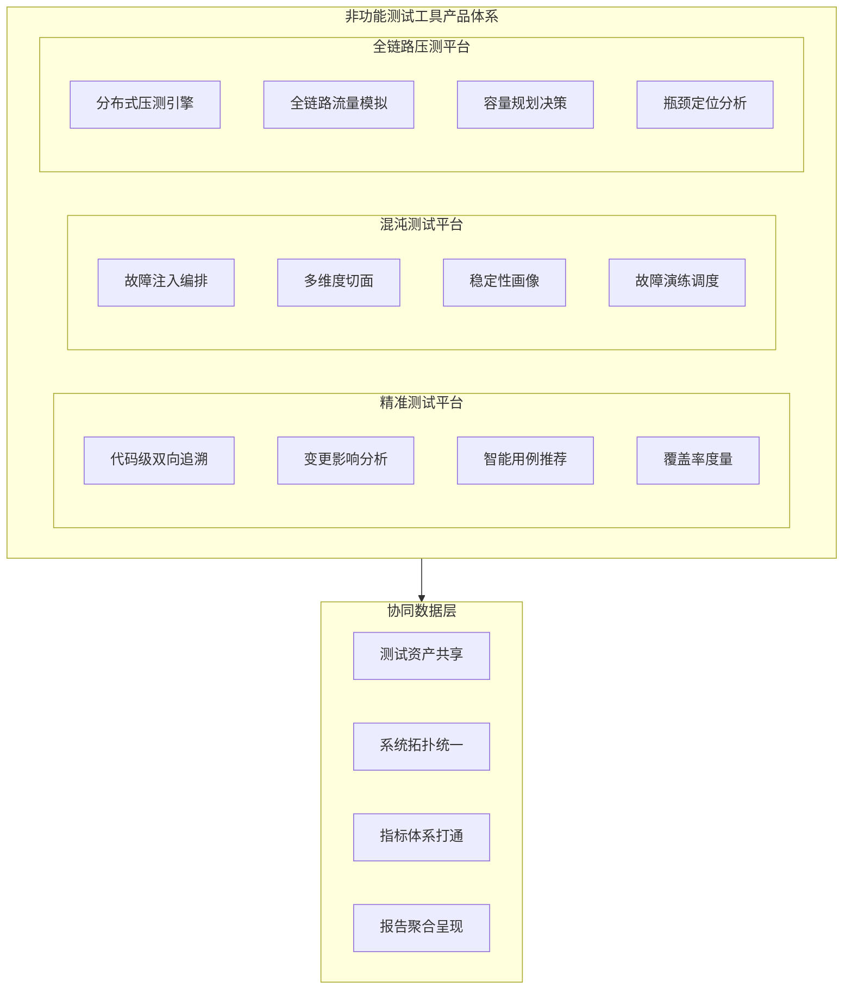
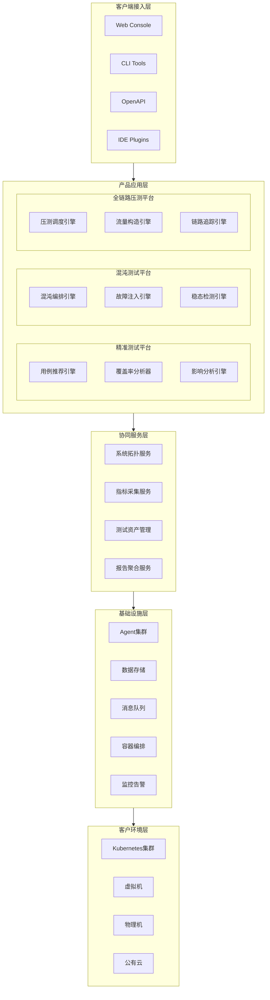
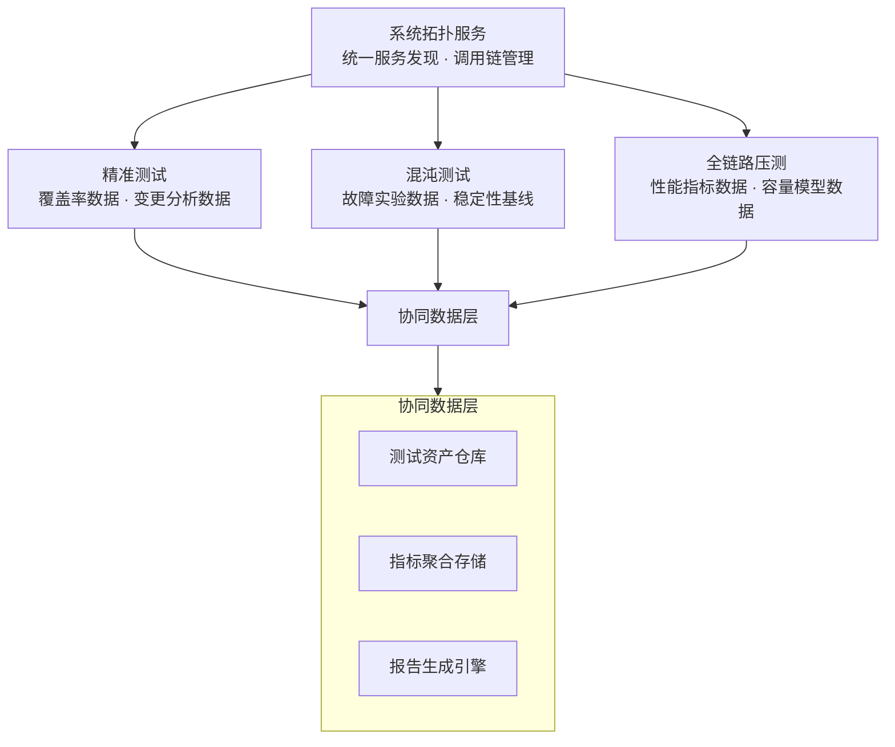

# 非功能测试工具产品体系

> 面向企业级客户的一站式非功能测试解决方案，涵盖精准测试、混沌测试、全链路压测三大核心平台

---

## 1. 项目概述

### 1.1 背景

随着微服务架构、云原生技术的深度普及，企业软件系统的复杂度呈指数级增长。传统的功能测试已无法覆盖系统在真实运行环境中面临的性能瓶颈、稳定性风险和质量盲区。非功能测试（性能测试、稳定性测试、质量效能测试）正在从"可选项"变为"必选项"，成为企业保障线上系统可靠运行的关键能力。

然而，当前市场上的非功能测试工具普遍存在以下痛点：

- **工具碎片化**：性能测试、稳定性测试、质量分析各自独立，数据割裂，无法形成统一的质量视图
- **技术门槛高**：混沌工程、全链路压测等先进方法论的实施需要深厚的底层技术积累
- **产品化不足**：多数工具停留在内部平台阶段，缺乏面向客户的标准化交付能力
- **协同效应缺失**：不同测试活动之间缺乏联动机制，无法形成闭环的质量保障体系

### 1.2 产品定位

本产品体系旨在提供**企业级非功能测试一站式解决方案**，通过三大核心平台的有机协同，帮助企业构建从代码级质量分析到系统级稳定性验证的完整非功能测试能力。

创始团队曾在小红书等头部互联网企业完成核心平台从零到一的建设与大规模落地验证，具备将内部工具产品化并面向客户交付的完整经验。

### 1.3 核心价值主张

| 价值维度 | 描述 |
|---------|------|
| **降本增效** | 精准测试减少90%无效回归；全链路压测在影子环境中验证容量，避免线上事故 |
| **风险前置** | 混沌测试主动发现稳定性隐患，在故障发生前完成修复，降低MTTR |
| **数据驱动** | 三大平台共享测试数据与系统画像，以量化指标驱动质量决策 |
| **开箱即用** | 标准化产品交付，支持SaaS与私有化部署，降低客户接入成本 |

---

## 2. 产品矩阵

### 2.1 产品全景图



### 2.2 精准测试平台（Precision Testing Platform）

| 属性 | 描述 |
|------|------|
| **定位** | 以代码分析为核心的测试智能化平台，解决"测什么、怎么测、测多少"的精准化问题 |
| **核心价值** | 回归测试效率提升90%，消除测试覆盖盲区，建立代码与用例的双向追溯关系 |
| **目标客户** | 中大型研发团队（50+开发者）、高频发布场景、质量合规要求高的行业（金融、通信） |

**核心能力**：

- **代码级双向追溯**：建立测试用例与代码行的精确映射，支持正向追溯（用例到代码）和逆向追溯（代码变更到用例）
- **变更影响分析**：基于代码依赖图和运行时调用链，自动评估代码变更的影响范围
- **智能用例推荐**：结合ML模型与规则引擎，根据变更精准推荐最小测试集合
- **多维覆盖率度量**：覆盖单元测试、集成测试、E2E测试、手动测试的全维度覆盖率聚合

**详细方案**：[精准测试产品方案](docs/precision_testing/product_solution.md)

### 2.3 混沌测试平台（Chaos Testing Platform）

| 属性 | 描述 |
|------|------|
| **定位** | 基于多维度故障注入的系统稳定性验证平台，主动发现和修复系统脆弱性 |
| **核心价值** | 将故障发现从事后被动响应转变为事前主动验证，显著降低线上故障MTTR |
| **目标客户** | 高可用性要求的业务系统（SLA 99.99%+）、微服务架构成熟度较高的团队 |

**核心能力**：

- **多维故障注入**：支持OS切面（CPU/内存/磁盘/进程）、网络切面（延迟/丢包/分区/带宽）、基础设施切面（容器/节点/可用区）的故障模拟
- **混沌编排引擎**：支持故障组合、时序编排、稳态假设验证的混沌实验编排能力
- **稳定性画像**：基于混沌实验结果构建系统稳定性基线，量化各服务的容错能力
- **安全巡检**：自动化定期执行混沌实验，持续验证系统韧性

**详细方案**：[混沌测试产品方案](docs/chaos_testing/product_solution.md)

### 2.4 全链路压测平台（Stress Testing Platform）

| 属性 | 描述 |
|------|------|
| **定位** | 基于影子表和分布式压测的全链路性能验证平台，在真实流量模型下评估系统容量 |
| **核心价值** | 在不影响线上业务的前提下，精准评估系统容量上限，为容量规划和性能优化提供数据支撑 |
| **目标客户** | 大促/活动场景、高并发业务系统、需要进行容量规划的运维团队 |

**核心能力**：

- **分布式压测引擎**：基于Gatling框架的分布式压测节点集群，支持百万级并发模拟
- **全链路流量隔离**：影子表 + 流量染色机制，压测流量全程隔离，零影响线上业务
- **真实流量回放**：基于线上流量模型构建压测场景，确保压测结果的真实性和可参考性
- **瓶颈定位分析**：压测过程中实时采集全链路指标，自动定位性能瓶颈点

**详细方案**：[全链路压测产品方案](docs/stress_testing/product_solution.md)

---

## 3. 整体架构

### 3.1 分层架构设计



### 3.2 协同能力矩阵

三大平台并非孤立运作，而是通过协同服务层形成联动机制：

| 协同场景 | 协同机制 | 价值输出 |
|---------|---------|---------|
| **精准测试 + 全链路压测** | 精准测试提供代码变更影响范围 -> 全链路压测针对受影响链路定向施压 | 避免全量压测，提升压测效率和针对性 |
| **混沌测试 + 全链路压测** | 全链路压测发现瓶颈点 -> 混沌测试在瓶颈点注入故障验证容错能力 | 性能瓶颈与稳定性风险联动分析 |
| **精准测试 + 混沌测试** | 精准测试识别高风险变更模块 -> 混沌测试针对该模块定向注入故障 | 变更风险评估与稳定性验证闭环 |
| **三平台联动** | 统一系统拓扑 + 共享指标体系 + 聚合质量报告 | 构建完整的非功能测试质量视图 |

### 3.3 数据流架构



### 3.4 部署架构

产品支持两种部署模式：

**SaaS 模式**：
- 控制平面部署在云侧
- Agent 通过安全通道接入客户环境
- 适合中小团队快速接入

**私有化部署模式**：
- 全栈部署在客户VPC或机房
- 数据不出客户网络边界
- 适合金融、政务等高合规要求客户

---

## 4. 目录结构

```
none_functional_testing_tools/
├── README.md                              # 整体方案框架（本文件）
├── claudedocs/                            # 研究报告与调研文档
│   ├── precision_testing_research_report.md   # 精准测试研究报告
│   ├── chaos_testing_research_report.md       # 混沌测试研究报告（待创建）
│   └── stress_testing_research_report.md      # 全链路压测研究报告（待创建）
├── docs/                                  # 产品方案文档
│   ├── precision_testing/                 # 精准测试产品方案
│   │   └── product_solution.md            # 产品方案详细文档（待创建）
│   ├── chaos_testing/                     # 混沌测试产品方案
│   │   └── product_solution.md            # 产品方案详细文档（待创建）
│   └── stress_testing/                    # 全链路压测产品方案
│       └── product_solution.md            # 产品方案详细文档（待创建）
```

### 4.1 文档约定

| 目录 | 用途 | 受众 |
|------|------|------|
| `claudedocs/` | 存放技术研究报告、竞品分析、市场调研等研究性文档 | 产品团队、技术团队 |
| `docs/` | 存放面向客户的产品方案文档，每个产品子目录独立维护 | 客户、销售团队、售前团队 |

### 4.2 文档命名规范

- 研究报告：`{topic}_research_report.md`
- 产品方案：`product_solution.md`
- 所有文档使用中文撰写

---

## 5. 各工具快速导航

### 精准测试平台

| 文档 | 路径 | 说明 |
|------|------|------|
| 研究报告 | [claudedocs/precision_testing_research_report.md](claudedocs/precision_testing_research_report.md) | 精准测试技术全景、行业现状、趋势分析 |
| 产品方案 | [docs/precision_testing/product_solution.md](docs/precision_testing/product_solution.md) | 精准测试平台产品化方案（待创建） |

### 混沌测试平台

| 文档 | 路径 | 说明 |
|------|------|------|
| 研究报告 | [claudedocs/chaos_testing_research_report.md](claudedocs/chaos_testing_research_report.md) | 混沌测试技术全景、行业现状、趋势分析（待创建） |
| 产品方案 | [docs/chaos_testing/product_solution.md](docs/chaos_testing/product_solution.md) | 混沌测试平台产品化方案（待创建） |

### 全链路压测平台

| 文档 | 路径 | 说明 |
|------|------|------|
| 研究报告 | [claudedocs/stress_testing_research_report.md](claudedocs/stress_testing_research_report.md) | 全链路压测技术全景、行业现状、趋势分析（待创建） |
| 产品方案 | [docs/stress_testing/product_solution.md](docs/stress_testing/product_solution.md) | 全链路压测平台产品化方案（待创建） |

---

## 6. 创始团队核心经验

创始团队在非功能测试领域具备从零到一的大规模落地经验：

| 平台 | 实践背景 | 核心能力积累 |
|------|---------|-------------|
| **全链路压测平台** | 曾在小红书搭建线上全链路压测平台 | 基于Gatling框架的分布式压测引擎、影子表流量隔离、全链路流量染色、真实流量回放 |
| **混沌测试平台** | 曾完成混沌测试平台从零到一的建设 | OS切面/网络切面/基础设施切面的故障注入、混沌编排引擎、稳态假设验证 |
| **精准测试平台** | 持续跟踪国际前沿技术与行业最佳实践 | 代码级双向追溯、变更影响分析、ML驱动的智能用例推荐、全维度覆盖率度量 |

这些经过大规模验证的技术方案，为产品化交付提供了坚实的技术基础。

---

## 7. 产品化策略

### 7.1 核心差异化优势

1. **实战验证**：核心能力经过头部互联网企业海量流量验证，非理论方案
2. **三合一协同**：业界首个将精准测试、混沌测试、全链路压测整合为统一产品体系的方案
3. **低侵入接入**：Agent化部署模式，最小化对客户现有系统的侵入
4. **灵活交付**：支持SaaS和私有化两种部署模式，适配不同合规要求

### 7.2 目标市场

| 市场层级 | 客户画像 | 核心诉求 | 推荐方案 |
|---------|---------|---------|---------|
| 一线互联网 | 研发团队500+，微服务架构成熟 | 全链路压测 + 混沌工程 | 三平台全量部署（私有化） |
| 二线互联网/独角兽 | 研发团队100-500，快速扩张中 | 精准测试 + 性能验证 | 精准测试 + 全链路压测（SaaS或私有化） |
| 金融/运营商 | 高合规要求，遗留系统与云原生并存 | 质量合规 + 稳定性保障 | 精准测试 + 混沌测试（私有化） |
| 传统企业数字化转型 | 研发团队50-100，技术栈统一中 | 测试效率提升 | 精准测试平台（SaaS） |

---

> **文档维护说明**：本文件为整体方案框架文档，各产品的详细技术方案请参见 `docs/` 目录下的对应文档。如有疑问或建议，请联系产品团队。
