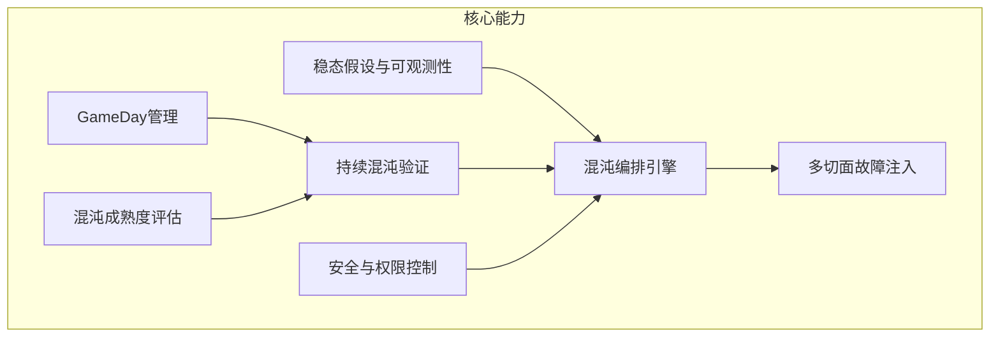
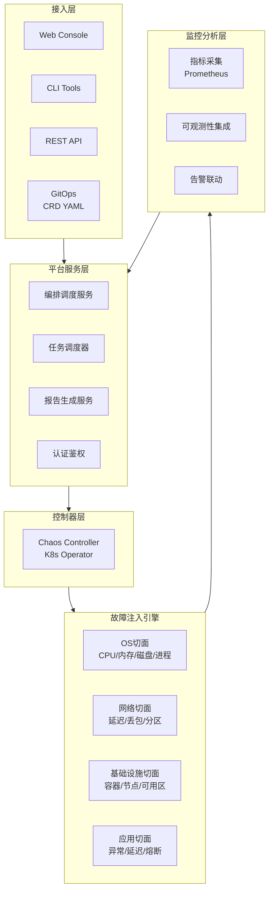

# ChaosForge 混沌测试平台 — 产品方案

> 基于多切面故障注入的系统稳定性验证平台，主动发现和修复系统脆弱性

---

## 1. 产品定位与价值主张

### 1.1 产品概述

| 属性 | 描述 |
|------|------|
| **产品名称** | ChaosForge 混沌测试平台 |
| **一句话定位** | 基于OS/网络/基础设施/应用四大切面故障注入的系统韧性验证平台 |
| **核心价值** | 将故障发现从事后被动响应转变为事前主动验证，显著降低线上故障MTTR |

### 1.2 核心价值主张

1. **风险前置**：在故障影响用户前主动发现并修复系统脆弱性
2. **韧性量化**：基于混沌实验结果构建系统稳定性基线，量化各服务容错能力
3. **故障演练常态化**：从年度GameDay演进到持续混沌验证（Continuous Chaos）
4. **全栈覆盖**：OS/网络/基础设施/应用四大切面全方位故障模拟

### 1.3 竞品差异化

| 维度 | ChaosForge | Chaos Mesh | Gremlin | AWS FIS |
|------|-----------|-----------|---------|---------|
| **部署模式** | SaaS + 私有化 | 自建 | SaaS | AWS绑定 |
| **环境覆盖** | K8s + VM + 物理机 | K8s only | K8s + VM | AWS only |
| **切面完整性** | 四大切面全覆盖 | K8s资源为主 | 三大切面 | AWS资源为主 |
| **编排能力** | 可视化+DSL | YAML CRD | GUI | YAML |
| **协同能力** | 三合一（精准+压测） | 独立 | 独立 | AWS生态 |
| **成本** | 合理定价 | 免费开源 | 昂贵SaaS | 按用量 |

---

## 2. 目标客户

### 2.1 目标行业与客户

| 行业 | 典型客户画像 | 核心诉求 |
|------|------------|---------|
| **互联网** | 大型互联网公司，SLA 99.99%+ | 系统韧性验证、故障演练常态化 |
| **金融** | 银行、保险，核心交易系统 | 高可用性合规验证、灾备演练 |
| **通信运营商** | 5G网络运维，核心网系统 | 99.999%可用性验证、网络韧性 |
| **电商** | 大促场景保障 | 峰值流量下的系统稳定性 |

### 2.2 痛点分析

- **线上故障频发**：缺乏系统化的故障预防手段
- **混沌工程门槛高**：需要深厚的底层技术积累才能实施
- **演练缺乏体系**：GameDay组织混乱，缺乏标准化流程和报告
- **工具碎片化**：不同类型故障使用不同工具，缺乏统一管理

---

## 3. 核心功能矩阵



### 3.1 多切面故障注入

详见第5节"切面化混沌工程详细设计"。

### 3.2 混沌编排引擎

- **可视化编排**：拖拽式编排故障组合和时序
- **模板库**：预置常见故障场景模板（微服务链路故障、数据库故障、网络分区等）
- **DSL支持**：YAML格式编排定义，支持版本控制
- **条件控制**：基于时间、指标阈值、人工确认的执行控制

### 3.3 稳态假设与可观测性

- **稳态假设定义**：实验前定义系统正常行为的指标基线
- **实时监控集成**：对接 Prometheus/Grafana/Datadog 等监控体系
- **SLO验证**：自动验证混沌实验期间SLO是否达标
- **告警联动**：异常时自动触发告警和回滚

### 3.4 持续混沌验证

- **Cron调度**：定期自动执行混沌实验
- **CI/CD触发**：代码部署后自动触发对应的混沌验证
- **渐进式实验**：从小范围到大范围逐步扩大爆炸半径
- **结果追踪**：历史实验结果对比和趋势分析

### 3.5 GameDay管理

- **演练计划**：制定故障演练计划，分配参与角色
- **实时指挥**：演练过程中的实时状态监控和指令下发
- **报告生成**：自动生成演练报告，包含发现、改进建议、跟进事项

### 3.6 安全与权限控制

- **爆炸半径控制**：限定故障影响的服务/命名空间/节点范围
- **自动回滚**：检测到异常指标时自动撤销故障注入
- **审批流**：高风险实验需要审批后才能执行
- **白名单**：保护关键服务不被注入故障

---

## 4. 技术架构设计

### 4.1 整体架构



### 4.2 技术选型

| 层级 | 技术选型 | 选型理由 |
|------|---------|---------|
| 后端 | Go (Controller) + K8s Operator | 云原生标准模式，与K8s深度集成 |
| 前端 | React + TypeScript | 企业级可视化编排 |
| 消息 | Kafka | 实验事件流和数据传输 |
| 存储 | PostgreSQL + ClickHouse | 业务数据 + 指标时序数据 |
| 部署 | Kubernetes + Helm Chart | 容器化部署，标准化交付 |
| 监控集成 | Prometheus + Grafana | 云原生监控标准栈 |

---

## 5. 切面化混沌工程详细设计

### 5.1 OS切面 — 系统资源故障

| 故障类型 | 实现原理 | 参数控制 |
|---------|---------|---------|
| CPU负载 | stress-ng / cgroup CPU quota | 核数、负载百分比、持续时间 |
| 内存泄漏 | malloc持续分配 / cgroup memory limit | 分配速率、上限、OOM控制 |
| 磁盘填充 | dd生成文件 / loop设备 | 填充比例、IOPS限制 |
| IO延迟 | device-mapper delay / eBPF | 延迟时间、读写比例 |
| 进程杀灭 | kill信号 / cgroup freeze | 信号类型、杀灭比例 |
| 文件系统故障 | mount只读 / fuse fault injection | 故障类型、影响路径 |

**安全措施**：cgroup限制资源使用上限，自动回滚确保不超出安全边界。

### 5.2 网络切面 — 网络质量故障

| 故障类型 | 实现原理 | 参数控制 |
|---------|---------|---------|
| 网络延迟 | tc (traffic control) + netem | 延迟时间、抖动、分布 |
| 丢包 | tc + netem / iptables | 丢包率、方向（入/出/双向） |
| 网络分区 | iptables DROP规则 | 分区范围、影响CIDR |
| 带宽限制 | tc + tbf (Token Bucket Filter) | 带宽上限、突发量 |
| DNS故障 | iptables重定向 + 自定义DNS响应 | 域名、响应类型（NXDOMAIN/超时） |
| 连接超时 | iptables + conntrack | 超时时间、连接数限制 |

**安全措施**：限定网络命名空间范围，保护管理网络不受影响。

### 5.3 基础设施切面 — 云资源故障

| 故障类型 | 实现原理 | 参数控制 |
|---------|---------|---------|
| 容器杀灭 | K8s API: delete pod | 命名空间、标签选择器、杀灭比例 |
| 节点下线 | K8s API: cordon + drain / node shutdown | 节点选择器、下线时长 |
| 可用区故障 | 批量节点cordon + 网络分区 | 可用区标记、影响范围 |
| 资源限制 | K8s API: patch resources | CPU/内存限制值 |
| 存储故障 | PVC删除 / IO故障注入 | 卷选择器、故障类型 |
| Deployment缩容 | K8s API: scale replicas | 副本数、缩容比例 |

### 5.4 应用切面 — 业务逻辑故障

| 故障类型 | 实现原理 | 参数控制 |
|---------|---------|---------|
| 异常抛出 | Java Agent字节码增强 / SDK注入 | 异常类型、接口、概率 |
| 方法延迟 | Agent方法级sleep / SDK | 延迟时间、接口、概率 |
| 线程池耗尽 | 动态调整线程池参数 | 池大小、拒绝策略 |
| 连接池耗尽 | 动态调整连接池参数 | 连接数、超时时间 |
| 熔断触发 | 熔断器配置动态修改 | 熔断阈值、恢复时间 |
| 返回值篡改 | Agent返回值修改 | 接口、篡改逻辑 |

---

## 6. 产品能力分层

| 能力 | 基础版 MVP | 专业版 | 企业版 |
|------|-----------|--------|--------|
| **故障切面** | OS + 网络 | +基础设施 +应用 | 全切面 + 自定义扩展 |
| **编排方式** | 单故障 + 简单组合 | 可视化编排 + YAML DSL | +条件编排 + 自动生成 |
| **稳态检测** | 基础指标检查 | +SLO验证 + 告警联动 | +AI异常检测 |
| **调度方式** | 手动触发 | +Cron定时 | +CI/CD联动 + 自适应 |
| **安全控制** | 基础白名单 | +审批流 + 自动回滚 | +自定义策略引擎 |
| **报告** | 基础实验报告 | +趋势分析 + 演练报告 | +成熟度评估 + 改进建议 |
| **部署** | K8s集群内 | K8s + VM混合 | 全环境覆盖 |
| **协同** | - | 独立使用 | 三平台联动 |

---

## 7. 关键技术方案

### 7.1 基于eBPF的内核级故障注入

- 利用eBPF程序在内核态拦截系统调用
- 实现网络延迟、IO延迟等低开销故障注入
- 无需修改目标进程，安全性高
- 支持精细化的过滤条件（PID、网络命名空间、cgroup）

### 7.2 基于tc/iptables的网络故障模拟

- 使用Linux tc (traffic control) + netem实现网络质量劣化
- iptables实现网络分区和连接控制
- 支持容器网络命名空间级别的精准控制

### 7.3 基于K8s Operator的容器故障管理

- 自定义CRD（Custom Resource Definition）定义故障资源
- Controller Watch CRD变化，自动创建/销毁故障
- 支持Helm Chart一键部署
- 与K8s RBAC深度集成，权限控制

### 7.4 混沌编排DSL设计

```yaml
apiVersion: chaos.chaosforge.io/v1alpha1
kind: ChaosExperiment
metadata:
  name: payment-service-resilience
spec:
  description: "支付服务韧性验证实验"
  steadyStateHypothesis:
    title: "支付成功率保持99.9%"
    probes:
      - name: payment-success-rate
        type: prometheus
        threshold: ">= 99.9"
  method:
    - type: network-delay
      target:
        selector: "app=payment-service"
      params:
        latency: "500ms"
        jitter: "100ms"
        duration: "5m"
    - type: pod-kill
      target:
        selector: "app=payment-db"
      params:
        killRatio: "0.5"
  rollback:
    automatic: true
    conditions:
      - metric: "payment-success-rate"
        operator: "<"
        value: "99.0"
```

### 7.5 自动回滚与爆炸半径控制

- **指标监控回滚**：持续监控关键指标，异常时自动撤销故障
- **超时回滚**：故障注入设置最大TTL，超时自动清理
- **爆炸半径标签**：通过K8s标签/注解限定影响范围
- **分级审批**：根据爆炸半径大小自动路由审批流程

---

## 8. 与其他工具的协同

### 8.1 混沌测试 + 全链路压测

- 全链路压测发现性能瓶颈点 -> 混沌测试在瓶颈点注入故障验证韧性
- 压测场景中嵌入混沌实验 -> 验证高负载下的系统容错能力
- **价值**：Chaos + Load融合，模拟真实生产中最危险的"高并发+故障"场景

### 8.2 混沌测试 + 精准测试

- 精准测试识别高风险变更模块 -> 混沌测试针对该模块定向注入故障
- 混沌实验结果关联代码覆盖 -> 评估故障暴露的测试充分性
- **价值**：变更风险评估与稳定性验证形成闭环

### 8.3 数据共享

- 共享系统拓扑：混沌测试的服务依赖关系丰富系统拓扑
- 共享可观测性：混沌实验的稳态基线纳入统一监控体系
- 聚合报告：三平台测试结果聚合为统一质量报告

---

## 9. 实施路线图

### Phase 1: MVP — OS + 网络切面 + 基础编排

- OS切面故障注入（CPU/内存/磁盘/进程）
- 网络切面故障注入（延迟/丢包/分区）
- 简单故障组合编排
- 手动触发 + 基础实验报告
- K8s Operator部署模式

### Phase 2: 增强 — 四大切面 + 可视化编排 + 可观测性

- 基础设施切面（容器/节点故障）
- 应用切面（异常/延迟注入）
- 可视化编排引擎
- 稳态检测与SLO验证
- 自动回滚与安全控制
- Prometheus/Grafana集成

### Phase 3: 协同 — 持续混沌 + AI场景生成 + 三平台联动

- 持续混沌验证（Cron + CI/CD触发）
- AI辅助混沌场景生成
- GameDay组织管理
- 混沌成熟度评估模型
- 与精准测试和全链路压测平台联动
- 统一非功能测试质量看板

---

> **文档版本**：v1.0 | **最后更新**：2026-04-16 | **维护团队**：ChaosForge 产品组
