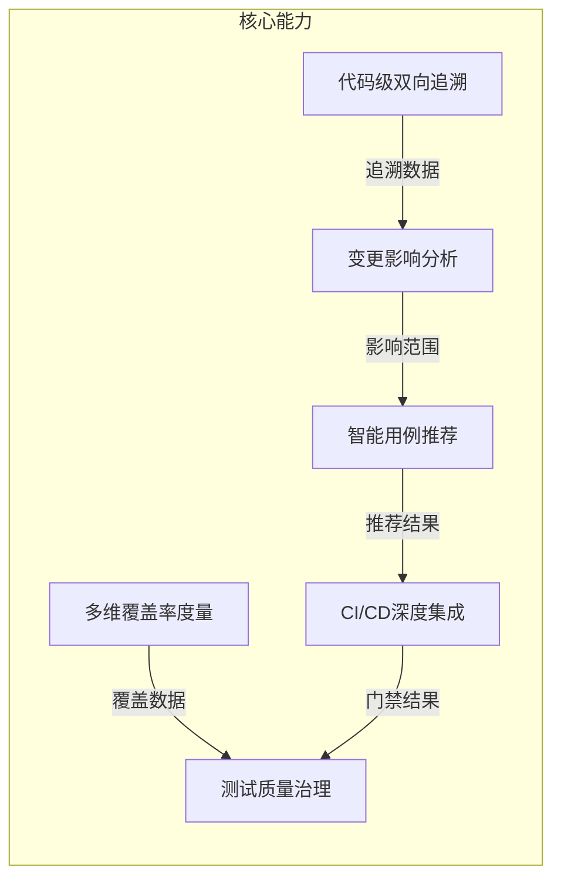
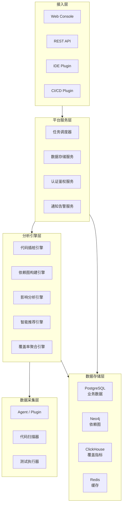

# PrecisionQA 精准测试平台 — 产品方案

> 以代码分析为核心的测试智能化平台，解决"测什么、怎么测、测多少"的精准化问题

---

## 1. 产品定位与价值主张

### 1.1 产品概述

| 属性 | 描述 |
|------|------|
| **产品名称** | PrecisionQA 精准测试平台 |
| **一句话定位** | 基于代码分析和机器学习的测试智能化平台，实现测试活动的精准化、可量化和可追溯化 |
| **核心价值** | 回归测试效率提升90%，消除测试覆盖盲区，建立代码与用例的双向追溯关系 |

### 1.2 核心价值主张

1. **测试效率飞跃**：通过智能用例推荐，回归测试执行量降低60-90%，CI反馈周期从小时级缩短到分钟级
2. **覆盖盲区消除**：跨单元/集成/E2E/手动测试的全维度覆盖率聚合，确保零覆盖盲区
3. **代码级双向追溯**：测试用例与代码行的精确映射，变更影响一目了然
4. **数据驱动决策**：量化指标驱动测试策略调整，从经验测试走向工程化测试

### 1.3 竞品差异化

| 维度 | PrecisionQA | 星云测试 | Launchable | SeaLights |
|------|-------------|---------|-----------|-----------|
| **部署模式** | SaaS + 私有化 | 私有化为主 | SaaS | SaaS |
| **语言覆盖** | Java/Go/Python/JS/TS | Java为主 | 多语言 | 多语言 |
| **AI能力** | ML推荐 + LLM辅助 | 规则驱动 | ML预测选择 | 运行时分析 |
| **协同能力** | 三合一（混沌+压测） | 独立平台 | 独立工具 | 独立平台 |
| **开源生态** | 基于JaCoCo/Istanbul开源生态 | 闭源 | 闭源 | 闭源 |

---

## 2. 目标客户

### 2.1 目标行业与客户

| 行业 | 典型客户画像 | 核心诉求 |
|------|------------|---------|
| **金融** | 银行、保险、证券，研发100-500人 | 质量合规、审计追溯、高风险变更验证 |
| **通信** | 运营商、设备商，研发200-1000人 | 高可用性要求、复杂遗留系统变更控制 |
| **互联网** | 中大型互联网公司，研发50-500人 | 发布效率、测试ROI、CI/CD加速 |

### 2.2 痛点分析

- **回归测试耗时**：每次发布全量回归，CI流水线动辄数小时
- **覆盖盲区**：只看单元测试覆盖率，集成/E2E/手动测试的覆盖情况未知
- **测试范围靠经验**：无法精确评估代码变更的影响范围
- **测试质量不可度量**：缺乏量化指标衡量测试活动的有效性

---

## 3. 核心功能矩阵



### 3.1 代码级双向追溯

- **正向追溯**：测试用例 -> 覆盖的代码行/分支/方法
- **逆向追溯**：代码变更 -> 需要执行的测试用例集合
- **跨测试类型**：统一单元测试、集成测试、E2E测试、手动测试的追溯数据
- **实时更新**：每次测试执行后自动更新追溯关系

### 3.2 变更影响分析

- **静态依赖分析**：基于import/module依赖构建代码依赖图
- **动态调用链分析**：基于运行时调用链数据补充静态分析盲区
- **影响范围计算**：代码diff -> 依赖图查询 -> 影响模块 -> 关联测试
- **风险评估**：基于代码复杂度、历史缺陷密度、变更规模综合评分

### 3.3 智能用例推荐

- **规则引擎**：基于依赖图精确匹配变更关联用例
- **ML模型**：基于历史测试运行数据训练预测模型，推荐最可能发现缺陷的用例子集
- **置信度控制**：不同开发阶段设置不同置信度阈值（PR 90% / Staging 95% / Release 100%）
- **动态调整**：根据测试结果持续优化推荐模型

### 3.4 多维覆盖率度量

| 覆盖类型 | 描述 | 度量粒度 |
|---------|------|---------|
| 行覆盖 | 代码行被执行比例 | 方法级 |
| 分支覆盖 | 条件分支被执行比例 | 分支级 |
| 路径覆盖 | 独立路径被执行比例 | 路径级 |
| 方法覆盖 | 方法被调用比例 | 类级 |
| 用户故事覆盖 | 用户故事关联代码的覆盖 | 需求级 |

### 3.5 CI/CD深度集成

- **PR门禁**：覆盖率下降拒绝合并、新增代码必须有覆盖
- **流水线阶段**：不同阶段运行不同置信度的测试子集
- **发布质量门禁**：高风险变更需要更高覆盖阈值
- **趋势报告**：覆盖率历史趋势、团队质量看板

### 3.6 测试质量治理

- **覆盖趋势分析**：项目/模块/团队覆盖率趋势追踪
- **质量画像**：模块级风险评分、缺陷密度热力图
- **测试效能分析**：用例执行效率、缺陷发现率、测试ROI

---

## 4. 技术架构设计

### 4.1 整体架构



### 4.2 核心模块说明

| 模块 | 职责 | 关键技术 |
|------|------|---------|
| **代码插桩引擎** | 在测试执行时采集代码覆盖数据 | JaCoCo Agent (Java), Istanbul/V8 (JS/TS), gcov (C/C++) |
| **依赖图构建引擎** | 构建代码组件间的静态和动态依赖关系 | 静态AST分析 + 运行时调用链采集, Neo4j图存储 |
| **影响分析引擎** | 基于变更diff和依赖图计算影响范围 | 图遍历算法 + 数据流分析 |
| **智能推荐引擎** | 根据影响范围和ML模型推荐测试用例 | 规则匹配 + ML预测模型 (XGBoost/LightGBM) |
| **覆盖率聚合引擎** | 跨测试类型覆盖率数据merge和度量 | 覆盖率数据标准化 + 聚合计算 |

### 4.3 技术选型

| 层级 | 技术选型 | 选型理由 |
|------|---------|---------|
| 后端 | Go (核心服务) + Java (Agent) | Go高性能API服务, Java Agent生态成熟 |
| 前端 | React + TypeScript | 企业级UI, 组件生态丰富 |
| 图数据库 | Neo4j | 代码依赖图的高效存储和查询 |
| 指标存储 | ClickHouse | 覆盖率时序数据的高效聚合查询 |
| 关系数据库 | PostgreSQL | 业务元数据和配置存储 |
| 消息队列 | Kafka | 测试执行事件和覆盖率数据的异步处理 |
| 部署 | Kubernetes | 容器化部署，弹性伸缩 |

---

## 5. 产品能力分层

| 能力 | 基础版 MVP | 专业版 | 企业版 |
|------|-----------|--------|--------|
| 代码覆盖率采集 | Java + JS/TS | +Go +Python +C/C++ | 全语言支持 |
| 覆盖率可视化 | 基础报告 | 趋势分析 + 热力图 | 自定义看板 |
| 变更影响分析 | 静态依赖分析 | +动态调用链 | +ML增强 |
| 智能用例推荐 | 规则匹配 | +ML推荐 | +LLM辅助生成 |
| CI/CD集成 | Jenkins + GitLab CI | +GitHub Actions + 通用 | +自定义Webhook |
| 质量门禁 | 覆盖率阈值 | +风险门禁 | +自定义策略引擎 |
| 覆盖类型 | 行覆盖 + 分支覆盖 | +路径 + 方法覆盖 | +MC/DC + 用户故事覆盖 |
| 部署模式 | SaaS | SaaS + 私有化 | 私有化 + 定制化 |
| 协同能力 | - | 独立使用 | 三平台联动 |

---

## 6. 关键技术方案

### 6.1 代码插桩实现

**Java生态（JaCoCo）**：
- 采用 on-the-fly 模式，通过 JVM Agent 在类加载时动态插桩
- 零侵入：无需修改源码和构建配置
- 与 Maven/Gradle 深度集成，支持 `prepare-agent` 和 `report` 生命周期

**JavaScript/TypeScript生态（Istanbul/nyc）**：
- 基于 V8 引擎内置覆盖率API
- 与 Jest/Mocha 无缝集成
- 支持 Source Map 还原

### 6.2 依赖图构建

```
代码仓库
  |
  +-- 静态分析 --> AST解析 --> import/module依赖 --> 模块依赖图
  |
  +-- 运行时采集 --> 调用链数据 --> 方法级依赖 --> 补充动态依赖
  |
  +-- 合并 --> 完整依赖图 --> Neo4j存储
```

### 6.3 影响分析算法

1. **变更检测**：解析 git diff，识别变更的文件和方法
2. **图查询**：在依赖图中查询变更节点的上下游依赖
3. **范围计算**：根据依赖距离和类型（强依赖/弱依赖）确定影响范围
4. **风险评分**：综合代码复杂度、历史缺陷密度、变更规模计算风险
5. **用例关联**：查询覆盖变更代码的测试用例集合

### 6.4 覆盖率数据聚合

1. 各测试类型（单元/集成/E2E/手动）独立采集覆盖率数据
2. 标准化为统一的覆盖率数据模型（行/分支/方法级别）
3. 执行merge操作，合并去重生成全维度覆盖视图
4. 按模块/包/类/方法分级聚合
5. 存入 ClickHouse 支持高效时序查询

---

## 7. 与其他工具的协同

### 7.1 精准测试 + 全链路压测

- 精准测试提供代码变更的影响范围 -> 全链路压测针对受影响链路定向施压
- 压测过程中采集的覆盖率数据 -> 反馈给精准测试丰富覆盖基线
- **价值**：避免全量压测，精准定位需要性能验证的服务和接口

### 7.2 精准测试 + 混沌测试

- 精准测试识别高风险变更模块 -> 混沌测试针对该模块定向注入故障
- 混沌实验覆盖的服务 -> 精准测试评估其测试覆盖充分性
- **价值**：变更风险评估与稳定性验证形成闭环

### 7.3 数据共享

- 共享系统拓扑服务：精准测试的代码依赖关系丰富系统拓扑
- 共享指标体系：覆盖率指标、风险评分纳入统一质量看板
- 聚合报告：三平台测试结果聚合为统一质量报告

---

## 8. 实施路线图

### Phase 1: MVP — 核心覆盖率与基础分析

- 代码覆盖率采集引擎（Java + JS/TS）
- 基础依赖图构建和变更影响分析
- Web Console 覆盖率可视化
- Jenkins/GitLab CI 集成
- 覆盖率门禁（基础阈值）

### Phase 2: 增强 — 智能化与深度集成

- ML驱动的智能用例推荐
- 多语言支持扩展（Go/Python）
- 动态调用链分析增强影响分析
- 多维覆盖度量（路径/方法/用户故事）
- GitHub Actions 集成
- 质量趋势看板和团队画像

### Phase 3: 协同 — 平台化与三合一联动

- LLM辅助测试用例生成
- 全链路覆盖率聚合
- 自定义质量策略引擎
- 与混沌测试平台联动
- 与全链路压测平台联动
- 统一非功能测试质量看板

---

> **文档版本**：v1.0 | **最后更新**：2026-04-16 | **维护团队**：PrecisionQA 产品组
