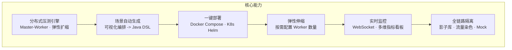
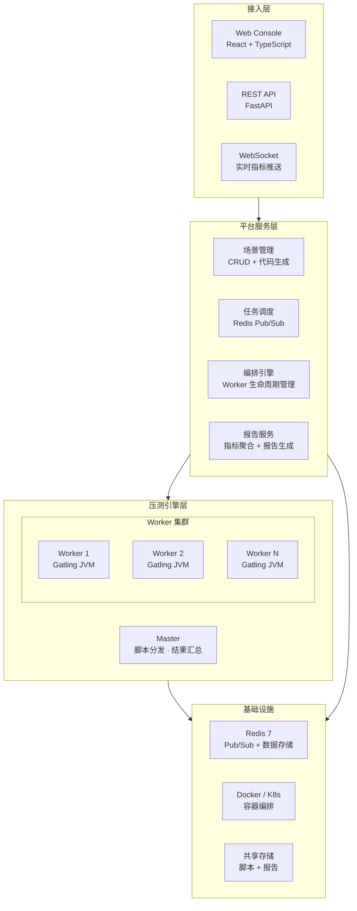
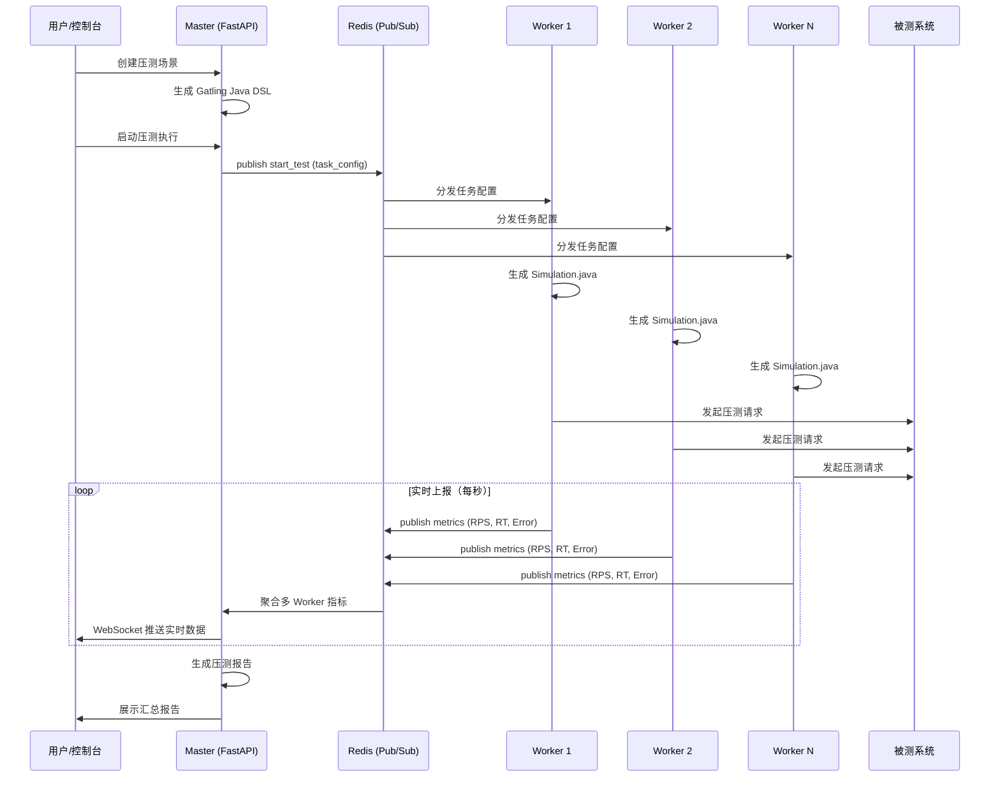
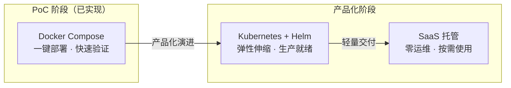
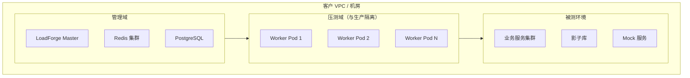

# LoadForge 全链路压测平台

## 产品方案介绍

---

| 属性 | 内容 |
|------|------|
| **文档版本** | v1.0 |
| **产品名称** | LoadForge 全链路压测平台 |
| **日期** | 2026年4月 |
| **密级** | 商业机密 - 仅限授权人员查阅 |

---

## 目录

1. [行业痛点与需求分析](#1-行业痛点与需求分析)
2. [产品概述](#2-产品概述)
3. [核心能力展示](#3-核心能力展示)
4. [技术架构](#4-技术架构)
5. [产品演示](#5-产品演示)
6. [竞品对比](#6-竞品对比)
7. [部署方案](#7-部署方案)
8. [客户案例场景](#8-客户案例场景)
9. [实施路线图](#9-实施路线图)
10. [团队背景](#10-团队背景)
11. [联系信息](#11-联系信息)

---

## 1. 行业痛点与需求分析

### 1.1 为什么企业需要专业压测平台

随着微服务架构和云原生技术的普及，系统复杂度呈指数级增长。一次大促活动的流量可能在数秒内暴涨数十倍，一次未经充分验证的版本发布可能导致线上服务雪崩。性能问题已经不是"会不会发生"的问题，而是"什么时候发生"的问题。

根据中国信息通信研究院发布的《云原生成熟度模型》和行业实践数据：

- **线上故障中约40%与性能相关**，且平均修复时间（MTTR）远高于功能故障
- **大促场景下的容量评估偏差率普遍超过30%**，源于压测模型与真实流量脱节
- **超过60%的企业尚未建立系统化的性能测试体系**，依赖临时性手工压测

### 1.2 当前企业的核心痛点

**痛点一：压测结果不可信**

多数企业使用开源工具（如 JMeter）进行单机或简单分布式压测，但缺乏真实流量模型的构建能力。压测场景与线上真实用户行为差异大，导致压测数据无法指导容量规划决策。压测结果中标注的"系统可承载 X QPS"在实际流量到来时往往无法兑现。

**痛点二：全链路压测风险高**

全链路压测需要压测流量穿透整个微服务调用链，涉及网关、服务层、消息队列、数据库等多层组件。缺乏流量标记和影子库机制的企业，只能选择：
- 在测试环境压测 -- 环境与生产差异大，结果参考价值有限
- 在生产环境直接压测 -- 数据写入生产库，存在数据污染和业务影响风险

**痛点三：瓶颈定位效率低**

压测完成后发现性能不达标，但缺乏全链路追踪能力，从"发现RT升高"到"定位到具体慢SQL或慢接口"往往需要数小时甚至数天的排查，严重影响问题修复效率。

**痛点四：工具能力碎片化**

压测工具、监控工具、APM工具各自独立，数据无法联动。性能测试团队需要同时操作多个系统才能完成一次完整的压测活动，协作成本高、效率低。

---

## 2. 产品概述

### 2.1 一句话定位

**LoadForge 是基于分布式 Gatling 引擎和影子库隔离的全链路性能验证与容量规划平台，在不影响线上业务的前提下，精准评估系统容量上限。**

### 2.2 产品核心价值

| 价值维度 | 说明 |
|---------|------|
| **零影响线上** | 影子表 + 流量染色机制，压测流量全程隔离，生产数据零污染 |
| **真实流量模型** | 基于线上流量特征构建压测场景，压测结果可直接指导容量规划 |
| **百万级并发** | 分布式 Gatling 引擎集群，Master-Worker 架构弹性扩展压测节点 |
| **智能瓶颈定位** | 全链路指标实时采集与聚合，自动识别性能瓶颈点 |

### 2.3 三大差异化优势

> **实战验证，而非理论方案**
> 核心团队曾在小红书等头部互联网企业从零搭建全链路压测平台并完成大规模落地验证。产品方案源自真实的海量流量场景经验。

> **可演示、可验证的 PoC**
> 当前已交付可运行的 PoC 演示版本，客户可直接体验从场景创建到压测执行再到报告生成的完整流程。3 Worker 并行执行，端到端零错误率。

> **三合一协同效应**
> LoadForge 可与精准测试平台、混沌测试平台联动，形成"代码级质量分析 -> 性能验证 -> 稳定性验证"的完整非功能测试闭环。

---

## 3. 核心能力展示

### 3.1 能力全景



### 3.2 分布式 Gatling 引擎

LoadForge 基于 Gatling 构建分布式压测引擎，采用 Master-Worker 架构：

- **Master 节点**：负责场景管理、任务调度、脚本分发、指标聚合与实时推送
- **Worker 节点**：运行独立 Gatling JVM 实例，执行压测任务，实时上报指标
- **弹性扩展**：Worker 数量可动态配置，支持从 1 到 N 的线性扩展

> **技术优势：为什么选择 Gatling 而非 JMeter？**
>
> Gatling 基于 Netty 实现异步非阻塞 HTTP 客户端，单节点即可支撑万级并发连接。相比之下，JMeter 基于线程模型，每个并发用户占用一个线程，在高并发场景下资源消耗远高于 Gatling。在同等硬件条件下，Gatling 的并发吞吐能力通常是 JMeter 的 5-10 倍。

### 3.3 场景自动生成

平台支持从 Web 控制台可视化创建压测场景，自动生成 Gatling Java DSL 代码：

- **参数化配置**：目标 URL、HTTP 方法、并发用户数、Ramp-up 时长、持续时长、自定义 Header
- **代码生成**：基于 Jinja2 模板引擎自动生成标准 Gatling Java Simulation 类
- **代码预览**：生成代码可在控制台预览，支持直接编辑和自定义扩展
- **场景模板**：预置电商、金融等行业常见压测场景模板

生成的代码示例片段：

```java
public class Sim_example extends Simulation {
    private HttpProtocolBuilder httpProtocol = http
        .baseUrl("http://target-service:8080")
        .header("x-load-test", "true")
        .acceptHeader("application/json");

    private ScenarioBuilder scn = scenario("Sim_example")
        .exec(
            http("GET /api/products")
                .get("/api/products")
                .check(status().is(200))
        );

    {
        setUp(
            scn.injectOpen(
                rampUsers(1000).during(Duration.ofSeconds(10)),
                constantUsersPerSec(1000.0).during(Duration.ofSeconds(60))
            )
        ).protocols(httpProtocol);
    }
}
```

### 3.4 一键部署

PoC 阶段提供 Docker Compose 一键部署方案，将 Master、Worker、Redis、前端、Demo 目标服务统一编排：

```bash
# 默认启动 3 个 Worker
./scripts/setup.sh

# 指定 Worker 数量
./scripts/setup.sh 10

# 运行中动态扩容
docker compose up -d --scale worker=20
```

完整的 Docker Compose 编排包含：
- **Redis 7**：通信中枢（Pub/Sub 命令分发 + 数据存储）
- **Master**：FastAPI 服务，提供 REST API + WebSocket
- **Worker**：Gatling JVM 实例，默认 3 个，可动态调整
- **Frontend**：React Web 控制台
- **Demo Target**：内置模拟电商 REST API，用于演示验证

### 3.5 弹性伸缩

Worker 数量通过环境变量 `WORKER_COUNT` 或 `docker compose --scale` 参数控制：

| 配置方式 | 命令 | 适用场景 |
|---------|------|---------|
| 环境变量 | `WORKER_COUNT=10 ./scripts/setup.sh` | 启动时指定 |
| 动态扩容 | `docker compose up -d --scale worker=20` | 运行中调整 |
| K8s（规划中） | HPA 自动伸缩 | 生产环境弹性调度 |

Worker 节点具备自动注册和心跳机制，启动后自动向 Redis 注册状态，Master 可实时感知可用 Worker 数量和健康状态。

### 3.6 实时监控

压测执行过程中通过 WebSocket 推送实时聚合指标：

| 指标 | 说明 |
|------|------|
| RPS | 每秒请求数（所有 Worker 聚合值） |
| Mean RT | 平均响应时间 |
| P50 / P90 / P95 / P99 RT | 响应时间百分位分布 |
| Max RT | 最大响应时间 |
| Error Rate | 错误率 |
| Active Users | 活跃并发用户数 |
| Total Requests / Errors | 累计请求量和错误量 |

Master 端的指标聚合器采用加权平均算法，根据各 Worker 的实际请求量计算全局响应时间百分位，确保聚合结果的准确性。

### 3.7 全链路支持（产品路线图）

以下能力已在产品规划中，当前 PoC 版本聚焦分布式引擎核心能力：

| 能力 | 实现方式 | 阶段 |
|------|---------|------|
| **影子库/影子表** | DataSource 路由 + MyBatis SQL 拦截，根据流量标记自动路由到影子表 | Phase 2 |
| **流量染色** | HTTP Header -> ThreadLocal -> RPC Attachment -> MQ Property 全链路透传 | Phase 2 |
| **第三方 Mock** | Mock Server 集群 + 流量录制回放 + 白名单放行 | Phase 2 |
| **数据构造与清洗** | 规则生成 + 生产数据脱敏 + 压测后自动清理 | Phase 2 |
| **APM 集成** | 对接 SkyWalking/Pinpoint/Jaeger 全链路追踪 | Phase 3 |

---

## 4. 技术架构

### 4.1 整体架构



### 4.2 Master-Worker 分布式架构



**核心调度流程**：

1. 用户通过 Web Console 创建压测场景，配置目标 URL、并发数、持续时间等参数
2. Master 的场景服务将配置参数通过模板引擎（Jinja2）生成标准 Gatling Java Simulation 代码
3. 用户启动压测执行时，Master 将任务配置写入 Redis，通过 Pub/Sub 广播 `start_test` 命令
4. 所有 Worker 接收到命令后，各自生成本地 Simulation 文件，编译并启动独立 Gatling JVM 进程
5. Worker 进程中的 MetricsCollector 实时解析 Gatling simulation.log，每秒将 RPS、RT 百分位、错误率等指标通过 Redis Pub/Sub 上报
6. Master 端的指标聚合器订阅 metrics 频道，采用加权平均算法将多 Worker 指标合并为全局视图
7. 聚合后的实时指标通过 WebSocket 推送到前端控制台展示
8. 压测结束后，Master 汇总生成完整压测报告

### 4.3 Redis 协调机制

Redis 在架构中承担三个关键角色：

| 角色 | 实现方式 | 说明 |
|------|---------|------|
| **命令分发** | Pub/Sub channel `loadforge:control` | Master 向所有 Worker 广播启动/停止命令 |
| **指标上报** | Pub/Sub channel `loadforge:metrics` | Worker 向 Master 上报实时指标数据 |
| **状态存储** | Redis Key-Value | 场景数据、执行记录、Worker 注册信息 |

Worker 注册与心跳机制：
- Worker 启动时在 Redis 中注册自身信息（ID、状态、主机名、启动时间）
- 每 5 秒更新一次心跳时间戳
- Master 可通过扫描 Worker Key 列表获取当前在线 Worker 数量和状态

### 4.4 Gatling 引擎深度集成

LoadForge 对 Gatling 的集成不是简单的"调用命令行"，而是实现了完整的生命周期管理：

| 集成层 | 实现内容 |
|--------|---------|
| **脚本生成** | Jinja2 模板引擎根据场景参数自动生成 Gatling Java DSL 代码 |
| **编译执行** | Worker 调用 Gatling 本地编译和运行模式执行生成的 Simulation |
| **指标采集** | 自定义 MetricsCollector 实时解析 Gatling simulation.log，提取请求级指标 |
| **结果聚合** | Master 端加权聚合多 Worker 的统计数据，确保百分位计算准确 |
| **报告生成** | 汇聚全量执行数据生成最终压测报告 |

### 4.5 部署选项



---

## 5. 产品演示

> **以下演示流程基于已完成的 PoC 版本，可在客户现场实时操作展示。**

### 5.1 演示环境

PoC 演示环境包含以下组件，全部通过 Docker Compose 一键启动：

| 组件 | 技术栈 | 说明 |
|------|--------|------|
| Web Console | React | 压测管理界面，场景创建、执行监控、报告查看 |
| API Server | FastAPI (Python) | REST API + WebSocket 实时推送 |
| Redis | Redis 7 Alpine | Worker 协调中枢 |
| Worker x3 | Gatling (Java JVM) | 分布式压测执行节点 |
| Demo Target | Python Flask | 模拟电商 REST API（商品列表、订单等） |

启动后访问 `http://localhost:3000` 即可进入 Web Console。

### 5.2 演示流程一：场景创建

**操作步骤**：

1. 打开 Web Console，进入"压测场景"页面
2. 点击"新建场景"，填写以下参数：
   - **目标 URL**：`http://demo-target:8080/api/products`（容器内地址）
   - **HTTP 方法**：GET
   - **并发用户数**：1000
   - **Ramp-up 时长**：10 秒
   - **持续时长**：60 秒
   - **Worker 数量**：3
3. 点击保存，场景卡片出现在列表中
4. 点击"预览代码"，查看自动生成的 Gatling Java DSL 代码

**演示要点**：
- 向客户展示从 Web 表单到可执行 Java 代码的自动转换过程
- 强调生成的代码包含标准的 `x-load-test: true` Header，为后续全链路流量标记提供基础
- 代码可导出，开发者可在此基础上进行自定义扩展

### 5.3 演示流程二：执行与监控

**操作步骤**：

1. 在场景卡片上点击"Run Test"
2. 进入"压测执行"页面，观察实时监控数据：
   - RPS（每秒请求数）实时曲线
   - 响应时间百分位分布（P50/P90/P99）
   - 错误率实时变化
   - 活跃用户数
3. 执行完成后，状态从"运行中"变为"已完成"

**演示要点**：
- 展示 3 个 Worker 并行工作，指标实时聚合的效果
- 所有请求的错误率为 0%，验证端到端流程的稳定性
- WebSocket 实时推送，无需刷新页面即可看到最新指标
- 可随时扩容 Worker 数量并重新执行，对比不同并发下的性能表现

### 5.4 演示流程三：报告查看

**操作步骤**：

1. 在"压测执行"页面查看历史执行记录列表
2. 点击某条执行记录，查看汇总报告：
   - 总请求量、总错误量
   - 响应时间统计（均值、P50、P90、P95、P99、最大值）
   - RPS 峰值和均值
   - 执行时长、参与 Worker 数量
3. 查看时间线维度的指标变化趋势

**演示要点**：
- 展示聚合后的完整压测报告，而非单个 Worker 的局部数据
- 报告中的数据可直接用于容量规划决策
- 对比多次执行结果，分析系统性能趋势

---

## 6. 竞品对比

### 6.1 全面对比

| 维度 | LoadForge | Apache JMeter | k6 (Grafana) | 阿里云 PTS |
|------|-----------|---------------|---------------|-----------|
| **压测引擎** | Gatling (异步非阻塞) | JMeter (线程阻塞模型) | k6 (Go 事件循环) | 自研引擎 |
| **并发模型** | 异步 IO，单节点万级并发 | 每用户一线程，资源消耗高 | 协程模型，性能较好 | 分布式集群 |
| **脚本开发** | Java DSL (可编程、可扩展) | GUI/JMX (重、难维护) | JavaScript (灵活) | 图形化 (受限) |
| **分布式** | Master-Worker，弹性扩展 | 需自行搭建 JMeter 集群 | k6 Operator (K8s) | 内置分布式 |
| **全链路能力** | 影子库 + 流量染色 + Mock (规划中) | 无 | 无 | 影子库 + 流量标记 |
| **部署模式** | SaaS + 私有化 | 自行部署 | SaaS + OSS | 阿里云绑定 |
| **实时监控** | WebSocket + Grafana | 聚合报告，无实时能力 | Grafana 生态 | Web 看板 |
| **扩展性** | Java 生态全面 | 插件体系成熟 | ES6 脚本 | 有限 |
| **学习成本** | 低（Web 界面 + 自动代码生成） | 高（GUI 操作复杂） | 中 | 低 |
| **协同能力** | 精准测试 + 混沌测试三合一 | 无 | Grafana 生态 | 阿里云生态 |
| **私有化** | 支持 | 支持 | 有限 | 不支持 |

### 6.2 核心差异化解读

**对比 JMeter**：

JMeter 是使用最广泛的开源压测工具，但存在明显短板。其线程模型意味着 1000 并发用户需要 1000 个线程，每线程占用约 1MB 栈空间，仅线程开销就需 1GB+ 内存。Gatling 的异步非阻塞模型在同等硬件下可支撑 5-10 倍的并发量。此外，JMeter 的 JMX 脚本格式不适合版本控制和 CI/CD 集成，而 LoadForge 生成的 Java DSL 代码天然支持 Git 管理。

**对比 k6**：

k6 在轻量级压测场景下表现优秀，但缺乏全链路压测的核心能力（影子库、流量染色）。其 JavaScript 脚本虽然灵活，但在 Java 占主导的企业技术栈中，Gatling 的 Java DSL 更易于集成和扩展。

**对比阿里云 PTS**：

阿里云 PTS 是国内最成熟的商业压测产品，具备全链路能力，但深度绑定阿里云生态，无法在其他云平台或私有化环境中使用。对于多云或混合云部署的企业，LoadForge 的部署灵活性是关键优势。

---

## 7. 部署方案

### 7.1 部署模式总览

| 部署模式 | 适用场景 | 数据存储 | 网络要求 | 交付周期 |
|---------|---------|---------|---------|---------|
| **SaaS 托管** | 中小团队快速接入 | 云侧存储 | 需公网访问 | 即开即用 |
| **私有云** | 数据安全合规要求 | 客户 VPC 内 | 内网即可 | 1-2 周 |
| **混合部署** | 多环境统一管理 | 客户侧为主 | VPN / 专线 | 2-4 周 |

### 7.2 私有化部署架构



私有化部署方案要点：
- **数据不出域**：所有组件部署在客户网络边界内，数据不经过外部网络
- **资源隔离**：压测 Worker 与生产服务部署在不同节点，通过 K8s ResourceQuota 限制资源
- **高可用**：Master 和 Redis 支持主备部署，数据库支持主从同步
- **安全接入**：支持 VPN / 专线接入管理域，可选 RBAC 权限控制

---

## 8. 客户案例场景

### 8.1 电商大促场景

**业务背景**：某电商平台年度大促活动，预计峰值 QPS 达到 50 万，需提前验证系统容量并制定扩容方案。

**LoadForge 方案**：

| 阶段 | 操作 | 产出 |
|------|------|------|
| 流量建模 | 基于历史大促流量数据构建压测场景（浏览 70% -> 加购 20% -> 下单 8% -> 支付 2%） | 真实流量模型 |
| 全链路压测 | 50 Worker 并行施压，影子库隔离，第三方支付走 Mock | 系统容量数据 |
| 瓶颈定位 | 结合 APM 追踪，识别慢接口和资源瓶颈 | 性能瓶颈清单 |
| 容量规划 | 基于压测数据构建容量模型，输出扩容建议 | 扩容方案 |

**预期成果**：容量评估偏差率从 30%+ 降低到 10% 以内，大促期间零性能故障。

### 8.2 金融结算场景

**业务背景**：某金融机构年终结算期间，需验证结算系统在高并发下的稳定性和数据一致性。

**LoadForge 方案**：

- 使用影子表隔离结算数据，压测结果可回溯验证
- 流量染色确保压测流量不触发真实的外部接口调用
- 设置安全阈值（RT > 3s 或错误率 > 1% 自动熔断）
- 压测报告作为合规审计数据留存

### 8.3 游戏版本上线场景

**业务背景**：某游戏公司新版本上线，预计首日 DAU 达到 500 万，需验证登录、匹配、支付等核心链路。

**LoadForge 方案**：

- 按业务链路建模：登录 -> 角色加载 -> 匹配 -> 对战结算 -> 支付
- 针对登录链路单独压测，验证认证服务的承载能力
- 对支付链路使用 Mock 隔离第三方支付网关
- 实时监控各链路 RT 和错误率，定位性能瓶颈

---

## 9. 实施路线图

### 9.1 分阶段交付计划

```mermaid
graph LR
    subgraph P1["Phase 1: MVP<br/>分布式压测引擎"]
        P1_1["Master-Worker 架构"]
        P1_2["HTTP/HTTPS 压测"]
        P1_3["场景自动生成"]
        P1_4["Web Console"]
        P1_5["基础监控与报告"]
    end

    subgraph P2["Phase 2: 增强<br/>全链路能力"]
        P2_1["流量染色引擎"]
        P2_2["影子库路由"]
        P2_3["第三方 Mock"]
        P2_4["业务链路编排"]
        P2_5["Grafana 看板"]
        P2_6["动态调速"]
    end

    subgraph P3["Phase 3: 协同<br/>自适应 + 持续性能测试"]
        P3_1["自适应压测"]
        P3_2["流量录制回放"]
        P3_3["CI/CD 集成"]
        P3_4["APM 深度集成"]
        P3_5["三平台联动"]
    end

    P1 -->|3 个月| P2
    P2 -->|4 个月| P3
```



### 9.2 各阶段交付物

**Phase 1 -- 分布式压测引擎（当前 PoC 已验证核心能力）**

| 能力 | 状态 | 说明 |
|------|------|------|
| Master-Worker 分布式架构 | PoC 已完成 | FastAPI Master + Gatling Worker，Redis 协调 |
| HTTP/HTTPS 协议压测 | PoC 已完成 | 支持 GET/POST，自定义 Header |
| 场景自动生成（Java DSL） | PoC 已完成 | Web 表单 -> Gatling Java 代码 |
| Docker Compose 一键部署 | PoC 已完成 | 默认 3 Worker，可配置扩展 |
| Web Console | PoC 已完成 | 场景管理、执行监控、报告查看 |
| WebSocket 实时监控 | PoC 已完成 | RPS、RT 百分位、错误率实时推送 |
| Gatling HTML 报告 | PoC 已完成 | 原生报告 + 聚合数据 |

**Phase 2 -- 全链路能力 + 监控分析**

| 能力 | 说明 |
|------|------|
| 流量标记全链路透传 | HTTP Header -> ThreadLocal -> RPC -> MQ -> DataSource |
| 影子库/影子表 | 自动建表、数据同步、压测后清理 |
| 第三方服务 Mock | Mock Server、流量录制回放、白名单 |
| 业务链路编排 | 多步骤场景、流量漏斗、参数化数据 |
| Grafana 实时看板 | 预置压测专用 Dashboard |
| 动态调速 | 手动调速、阶梯加压、安全阈值 |

**Phase 3 -- 自适应 + 持续性能测试**

| 能力 | 说明 |
|------|------|
| 自适应压测 | 自动寻找性能拐点，阶梯探测 |
| 生产流量录制回放 | 基于线上流量特征构建压测场景 |
| CI/CD 集成 | Jenkins/GitLab CI 插件，持续性能测试 |
| APM 深度集成 | SkyWalking/Pinpoint 全链路追踪联动 |
| 容量规划模型 | 基于压测数据输出容量规划建议 |
| 三平台联动 | 精准测试 + 混沌测试 + 压测协同 |

---

## 10. 团队背景

### 10.1 核心团队经验

| 领域 | 实践背景 | 核心能力积累 |
|------|---------|-------------|
| **全链路压测** | 曾在小红书搭建线上全链路压测平台 | 分布式 Gatling 引擎、影子表流量隔离、全链路流量染色、真实流量回放 |
| **混沌工程** | 完成混沌测试平台从零到一的建设 | OS/网络/基础设施多维故障注入、混沌编排、稳态假设验证 |
| **精准测试** | 持续跟踪国际前沿技术与行业实践 | 代码级双向追溯、变更影响分析、智能用例推荐 |

### 10.2 为什么选择我们

1. **不是从零开始**：核心能力已在头部互联网企业的海量流量场景中验证，我们做的是将经过验证的内部平台产品化
2. **理解真实痛点**：团队亲身经历过多次大促压测、故障排查、容量规划的完整过程，理解企业用户真正的需求
3. **PoC 可验证**：不接受"画饼式"交付。PoC 版本已完成端到端验证，客户可亲自操作体验
4. **持续演进**：产品路线图清晰，从分布式引擎到全链路能力到三平台协同，每个阶段都有明确的交付物

---

## 11. 联系信息

| 属性 | 内容 |
|------|------|
| **产品咨询** | [待补充] |
| **技术交流** | [待补充] |
| **商务合作** | [待补充] |
| **公司地址** | [待补充] |

> 如需预约产品演示或获取 PoC 体验环境，请联系上述渠道。我们可在 1 个工作日内提供可运行的演示环境。

---

*本文档为 LoadForge 全链路压测平台产品介绍，仅供客户评估参考。未经授权不得外传。*
