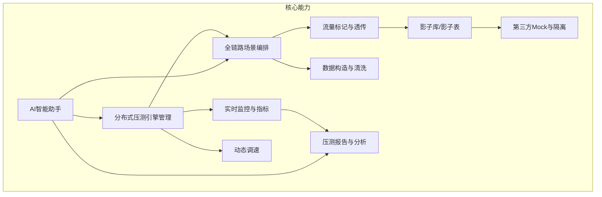
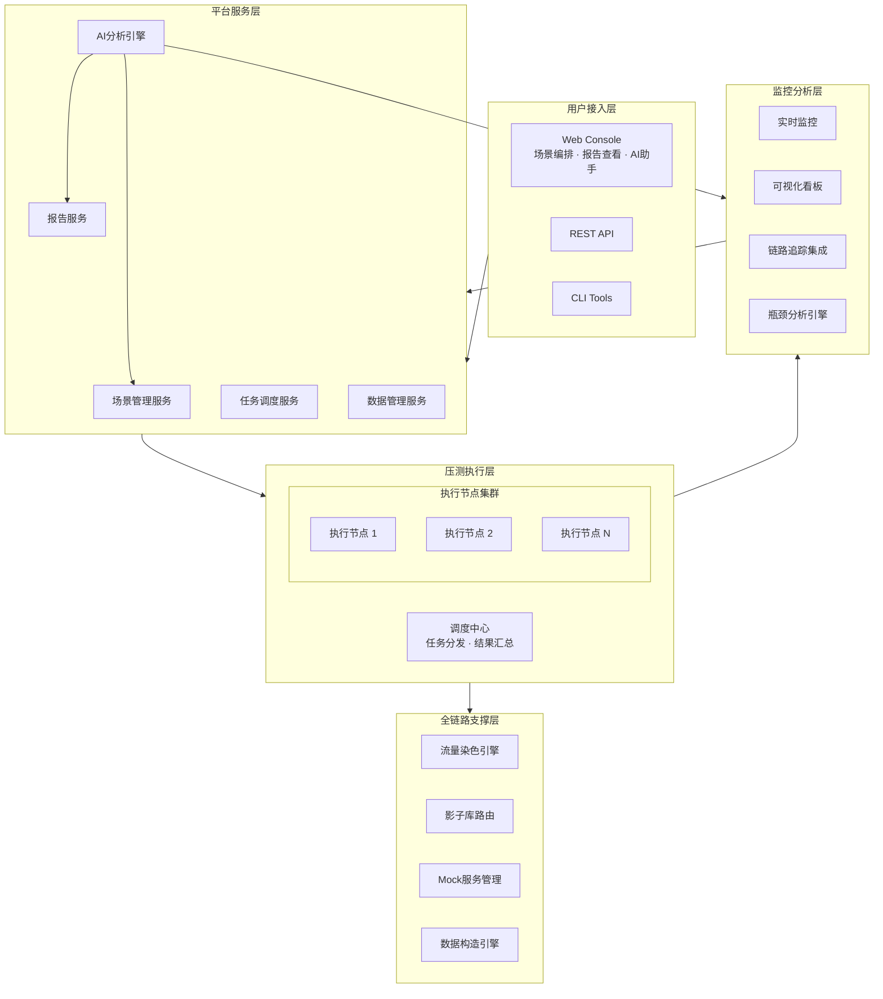
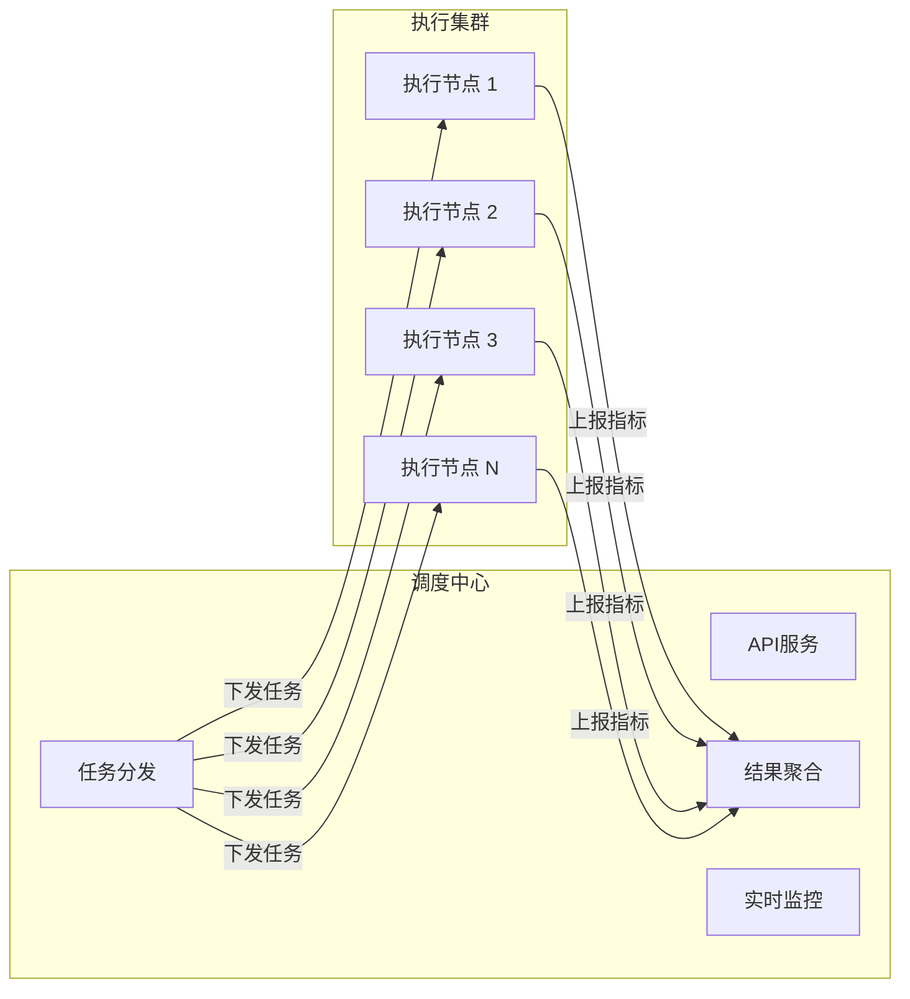
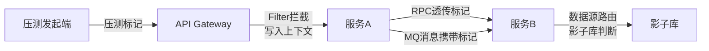

# LoadForge 全链路压测平台 — 产品方案

> **企业级全链路性能验证与容量规划平台**
>
> 在不影响线上业务的前提下，精准评估系统容量上限，为容量规划和性能优化提供数据支撑

---

## 一、产品定位与价值主张

### 1.1 产品概述

| 属性 | 描述 |
|:-----|:-----|
| **产品名称** | LoadForge 全链路压测平台 |
| **产品定位** | 企业级全链路性能验证与容量规划平台，一站式覆盖压测场景编排、流量隔离、实时监控与智能分析 |
| **核心价值** | 安全模拟真实业务流量，精准评估系统在峰值场景下的表现，帮助团队在上线前发现并消除性能隐患 |

### 1.2 核心价值主张

> **五大核心能力，护航每一次大流量挑战**

| # | 能力 | 说明 |
|:-:|:-----|:-----|
| 1 | **零影响线上** | 影子表 + 流量染色机制，压测流量全程隔离，保障生产数据安全 |
| 2 | **真实流量模型** | 基于线上流量特征构建压测场景，确保结果与实际表现高度吻合 |
| 3 | **百万级并发** | 弹性分布式引擎集群，按需扩展压测节点，轻松应对极端峰值模拟 |
| 4 | **智能瓶颈定位** | 全链路指标实时采集，AI 辅助自动定位性能瓶颈点，缩短排查时间 |
| 5 | **AI 脚本助手** | 内置智能分析能力，自动解析复杂压测脚本、提供优化建议、辅助根因定位 |

### 1.3 竞品差异化

| 对比维度 | LoadForge | 阿里云 PTS | JMeter Cloud | k6 Cloud |
|:---------|:----------|:----------|:-------------|:---------|
| **全链路能力** | 影子库 + 流量标记 + Mock 完整方案 | 影子库 + 流量标记 | 无 | 无 |
| **AI 辅助能力** | 脚本分析 + 优化建议 + 根因定位 + 全流程咨询 | 无 | 无 | 无 |
| **部署模式** | SaaS + 私有化 | 阿里云绑定 | SaaS | SaaS |
| **场景编排** | 可视化业务链路编排 + 行业模板 | 图形化 | GUI/JMX | JavaScript |
| **协同能力** | 三合一（精准测试 + 混沌测试 + 压测） | 阿里云生态 | 独立 | Grafana 生态 |
| **目标客群适配** | 电商/金融/游戏/互联网全覆盖 | 偏阿里云客户 | 通用技术用户 | 开发者 |

---

## 二、目标客户

### 2.1 目标行业与客户

| 行业 | 典型客户画像 | 核心诉求 |
|:-----|:------------|:---------|
| **电商** | 大促/秒杀场景，QPS 10万+ | 容量评估、瓶颈定位、扩容决策 |
| **金融** | 年终结算、新股申购，高并发交易 | 性能基线、容量规划、合规验证 |
| **游戏** | 新版本上线、活动爆发 | 登录/支付链路压测、体验保障 |
| **互联网** | 社交/内容平台，流量波动大 | 全链路容量验证、弹性伸缩验证 |

### 2.2 行业痛点分析

| # | 痛点 | 具体表现 |
|:-:|:-----|:---------|
| 1 | **容量评估不精准** | 缺乏真实流量模型，压测结果与线上表现偏差大 |
| 2 | **压测影响线上** | 压测数据写入生产库，可能造成数据污染和业务影响 |
| 3 | **全链路隔离困难** | 缺乏流量标记和影子库机制，无法安全执行全链路压测 |
| 4 | **瓶颈定位慢** | 压测后发现性能问题，但无法快速定位瓶颈点和根因 |
| 5 | **测试场景单一** | 只有单接口压测能力，缺乏业务链路级别的压测 |
| 6 | **脚本维护难** | 复杂压测脚本难以理解，人员变动后知识断层，优化无从下手 |
| 7 | **技术门槛高** | 性能测试专业性要求高，新人上手周期长，团队协作困难 |

---

## 三、核心功能矩阵



### 3.1 分布式压测引擎管理

> 弹性调度，按需扩展，轻松应对百万级并发模拟

- **弹性调度**：根据目标并发量自动计算所需节点数量，按需分配资源
- **容器化部署**：支持 Kubernetes 环境，节点动态创建和销毁，资源按需使用
- **健康检查**：节点心跳监控，异常节点自动替换，保障压测任务稳定执行
- **资源隔离**：节点资源配额管理，压测流量不占用生产资源

### 3.2 全链路压测场景编排

> 可视化链路编排，真实还原业务场景

- **业务链路建模**：可视化定义业务链路（如：浏览 → 加购 → 下单 → 支付）
- **流量漏斗**：定义各环节的转化率（如：浏览 100% → 加购 30% → 下单 10% → 支付 8%），模拟真实用户行为
- **场景模板库**：预置电商/金融/游戏等行业常见压测场景模板，开箱即用
- **数据参数化**：支持 CSV/JSON/数据库等多种数据源驱动，灵活构造测试数据

### 3.3 流量标记与透传

> 全链路标记一致性，压测流量精准识别

- **全链路一致性**：HTTP → 网关 → 服务 → RPC → 消息队列 → 数据库，确保压测标记在整个调用链中不丢失
- **协议全覆盖**：支持 HTTP Header、RPC 附件、MQ 消息属性等多种传播方式
- **零侵入接入**：通过 Agent 自动注入标记逻辑，无需修改业务代码

### 3.4 影子库/影子表

> 压测数据全隔离，生产环境零影响

- **自动数据路由**：根据流量标记自动将压测请求路由到影子数据源
- **自动建表**：基于生产表结构自动创建影子表，DDL 变更自动同步
- **数据同步**：定期从生产库同步基础数据到影子库，保障数据真实性
- **自动清理**：压测完成后自动清理影子表数据，无需人工干预

### 3.5 第三方服务 Mock

> 外部依赖安全隔离，规避费用和合规风险

- **Mock 服务管理**：对外部依赖服务（支付、短信、三方 API）提供模拟响应
- **流量录制回放**：录制真实接口响应，压测时回放，兼顾真实性和安全性
- **白名单机制**：核心服务走真实链路，外部依赖走 Mock，灵活可控

### 3.6 实时监控与指标

> 全维度指标秒级更新，一眼掌握系统状态

- **全链路指标**：QPS、响应时间（P50/P90/P99/P999）、错误率、吞吐量
- **资源指标**：CPU、内存、网络 IO、磁盘 IO、连接池状态
- **链路追踪集成**：对接主流 APM 工具，实现全链路性能可视化
- **实时看板**：压测过程中指标秒级更新

### 3.7 压测数据构造与清洗

> 测试数据自动构造，合规脱敏，自动清理

- **数据生成**：基于规则和模板批量生成测试数据
- **生产数据脱敏**：从生产环境导出并自动脱敏后使用，保障数据安全合规
- **分布式分发**：数据文件自动分发到各执行节点
- **自动清洗**：压测结束后自动清理影子表和临时数据

### 3.8 压测报告与分析

> 实时报告 + 趋势对比 + 容量模型，数据驱动决策

- **实时报告**：压测过程中实时更新报告，无需等待压测结束
- **趋势对比**：多次压测结果对比，分析性能变化趋势
- **瓶颈分析**：自动识别响应时间最高、错误率最高的接口和服务
- **容量模型**：基于压测数据构建系统容量模型，输出容量规划建议

### 3.9 动态调速

> 智能调速，精准定位性能拐点

- **手动调速**：压测过程中随时调整 QPS/并发数
- **阶梯加压**：自动按阶梯增加负载（如 100 → 500 → 1000 → 2000 QPS），精准定位性能拐点
- **安全阈值**：设置响应时间/错误率阈值，超阈值自动降速或停止，保护系统安全
- **自适应模式**：系统自动寻找性能拐点，无需手动调参

### 3.10 AI 智能助手

> **内置 AI 性能测试顾问，覆盖压测全生命周期**

LoadForge 内置 AI 智能分析能力，作为团队的随身性能测试顾问，让每一位测试工程师都能拥有专家级分析能力：

| 智能能力 | 功能说明 | 用户收益 |
|:---------|:---------|:---------|
| **脚本智能解析** | 自动按协议、操作、接口调用、事务、核心模拟点拆解复杂脚本 | 快速读懂复杂脚本，新人上手周期缩短 **60%** |
| **高效知识共享** | 生成简洁的脚本概述和场景文档 | 促进跨团队协作，消除人员变动导致的知识断层 |
| **可落地优化建议** | 针对协议特性推荐专项优化方案：剔除冗余调用、参数化、异常处理优化、思考时间调整、关联逻辑改进 | 脚本运行效率、扩展性、稳定性大幅提升 |
| **根因定位指导** | 自动分析日志，针对关联失败、网络异常、服务端故障等常见问题，提供结构化排查步骤 | 问题定位时间缩短 **70%**，减少人工反复试错 |
| **测试配置优化** | 分析应用技术栈，推荐最合适的录制协议和场景配置 | 避免协议选错导致模拟失真，保障测试结果准确性 |
| **全流程咨询支持** | 覆盖架构分析、目标制定、计划排期、脚本开发、场景执行、监控分析、最终优化的全生命周期指导 | 随身在线性能测试顾问，赋能团队独立完成高质量性能测试 |

---

## 四、产品架构

### 4.1 分层架构



### 4.2 压测执行流程



**执行流程**：

1. 用户提交压测任务 → 调度中心根据并发目标计算所需节点数量
2. 自动拉起执行节点（K8s 环境）或复用已有节点
3. 将压测脚本和参数分发到各节点
4. 各节点同时发起压测请求
5. 节点实时上报指标到调度中心
6. 调度中心聚合所有节点指标，生成实时报告
7. 压测结束后自动回收资源

---

## 五、全链路压测详细方案

### 5.1 流量标记方案



**标记传播链路**：压测请求从入口到数据库全程携带标记，无需人工干预：

| 层级 | 标记传播方式 | 实现机制 |
|:-----|:-----------|:---------|
| **入口层** | 请求自动携带压测标识 | 引擎自动注入 |
| **网关层** | 网关识别标记，写入请求上下文 | 网关 Filter |
| **服务层** | Agent 自动拦截，写入线程上下文 | Java Agent |
| **RPC 层** | 跨服务调用自动透传标记 | Dubbo/gRPC Attachment |
| **MQ 层** | 消息属性自动携带标记 | Kafka/RocketMQ Properties |
| **数据层** | 根据标记自动路由到影子库 | DataSource 路由 |

### 5.2 影子库实现方案

```
请求进入服务
  |
  +-- 检查: 是否为压测流量?
  |     |
  |     +-- 是 --> 影子数据源
  |     |            |
  |     |            +-- 影子表 (自动创建、自动同步、自动清理)
  |     |
  |     +-- 否 --> 生产数据源
  |                  |
  |                  +-- 生产表 (不受任何影响)
```

**核心特性**：

| 特性 | 说明 |
|:-----|:-----|
| **自动建表** | 压测前扫描生产表结构，自动创建影子表 |
| **数据初始化** | 从生产库同步基础数据（脱敏后） |
| **SQL 自动路由** | 无需修改业务代码，自动将压测流量 SQL 路由到影子表 |
| **清理策略** | 压测结束后按策略清理（全量清理 / 按时间清理 / 保留） |

### 5.3 第三方服务隔离

| 隔离方式 | 适用场景 | 用户收益 |
|:---------|:---------|:---------|
| **Mock 服务** | 外部支付/短信等第三方 API | 避免压测对三方服务造成影响，规避费用和合规风险 |
| **流量录制回放** | 需要真实响应数据的场景 | 兼顾真实性和隔离性 |
| **白名单放行** | 核心依赖必须走真实链路 | 灵活控制隔离范围 |
| **降级模拟** | 验证依赖降级场景 | 提前验证容灾预案 |

### 5.4 数据构造与清洗

- **构造方式**：SQL 脚本 + 程序化生成 + 生产数据脱敏
- **参数化**：CSV/JSON 数据文件，支持随机/顺序/唯一选取策略
- **分发机制**：数据文件上传后自动分发到各执行节点
- **清洗策略**：压测后自动清理影子表，可配置保留部分数据供分析

---

## 六、产品能力分层

| 能力维度 | 基础版 (MVP) | 专业版 | 企业版 |
|:---------|:------------|:-------|:-------|
| **压测引擎** | 单机执行 | 分布式集群 | 弹性伸缩集群 |
| **协议支持** | HTTP/HTTPS | +WebSocket +TCP | +Kafka +gRPC +自定义 |
| **场景编排** | 单接口压测 | +业务链路编排 | +流量漏斗 +自适应 |
| **全链路** | — | 流量标记 + 影子库 + Mock | +自动建表 + 数据同步 |
| **监控** | 基础 QPS/RT | +实时看板 | +链路追踪 + 瓶颈分析 |
| **报告** | 基础报告 | +趋势对比 | +容量模型 + 规划建议 |
| **AI 助手** | 脚本解析 + 配置建议 | +优化建议 + 根因定位 | +全流程咨询 |
| **安全** | 基础限速 | +安全阈值 + 自动停止 | +审批流 + 自定义策略 |
| **数据** | 手动 CSV | +数据构造工具 | +脱敏 + 自动清洗 |
| **部署** | 单机 | K8s 集群 | 多集群 + 混合云 |
| **协同** | — | 独立使用 | 三平台联动 |

---

## 七、压测安全管控

> **安全是压测的生命线** — 多重防护机制确保每一次压测安全可控

| 安全机制 | 说明 |
|:---------|:-----|
| **流量上限保护** | 全局 QPS 上限，防止过载 |
| **异常熔断** | 错误率超过阈值自动停止压测 |
| **自动停止** | 响应时间超过阈值自动降速或停止 |
| **审批流** | 大流量压测需要审批，防止误操作 |
| **回滚机制** | 异常时一键回滚所有执行节点和流量标记 |
| **资源隔离** | 压测资源配额管理，确保不影响生产环境正常运行 |

---

## 八、与其他工具的协同

### 8.1 全链路压测 + 精准测试

- 精准测试提供代码变更影响范围 → 全链路压测针对受影响链路定向施压
- 压测过程采集覆盖率数据 → 反馈给精准测试丰富覆盖基线
- **价值**：避免全量压测，精准验证变更对性能的影响

### 8.2 全链路压测 + 混沌测试

- 压测同时注入故障 → 验证高负载下的系统容错能力
- 压测发现瓶颈点 → 混沌测试在瓶颈点注入故障验证韧性
- **价值**：模拟真实生产中最危险的"高并发 + 故障"场景

### 8.3 数据共享

- 共享性能基线：压测建立性能基线供混沌测试引用
- 共享容量模型：压测的容量数据供混沌实验设计参考
- 聚合报告：三平台测试结果聚合为统一质量报告

---

## 九、实施路线图

### Phase 1 — 分布式压测引擎（MVP）

| 交付物 | 说明 |
|:-------|:-----|
| 分布式压测引擎 | 调度中心 + 弹性执行集群 |
| 协议支持 | HTTP/HTTPS 协议压测 |
| 场景编排 | 单接口 + 简单链路 |
| 监控能力 | 基础 QPS/RT 监控 |
| 报告生成 | 实时报告 |
| 管理界面 | Web Console 基础功能 |
| AI 能力 | 脚本解析与配置建议 |

### Phase 2 — 全链路能力 + 智能分析

| 交付物 | 说明 |
|:-------|:-----|
| 全链路流量标记 | 标记透传（HTTP → RPC → MQ → DB） |
| 影子库/影子表 | 自动建表、数据同步、自动清理 |
| Mock 管理 | 第三方服务隔离 |
| 业务链路编排 | 流量漏斗 + 链路建模 |
| 可视化看板 | 实时监控大盘 |
| 数据工具 | 数据构造和清洗 |
| 动态调速 | 手动/阶梯/安全阈值/自适应 |
| AI 能力 | 优化建议 + 根因定位 |

### Phase 3 — 自适应 + 持续性能测试

| 交付物 | 说明 |
|:-------|:-----|
| 自适应压测 | 自动寻找性能拐点 |
| 流量录制回放 | 生产流量模型复用 |
| 持续性能测试 | CI/CD 集成 |
| 容量规划 | 决策模型输出 |
| 链路追踪深度集成 | APM 深度对接 |
| AI 全流程咨询 | 完整生命周期指导 |
| 平台联动 | 精准测试 + 混沌测试 + 压测三合一 |
| 统一质量看板 | 非功能测试全景视图 |

---

> **文档版本**：v2.0 | **最后更新**：2026-04-20 | **维护团队**：LoadForge 产品组
