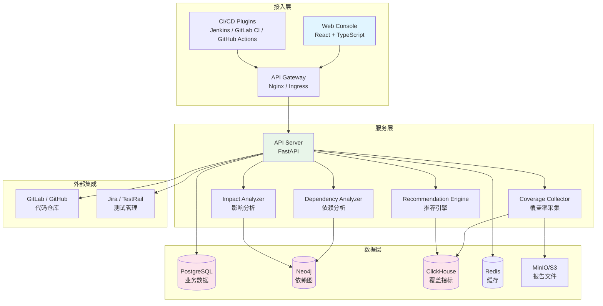
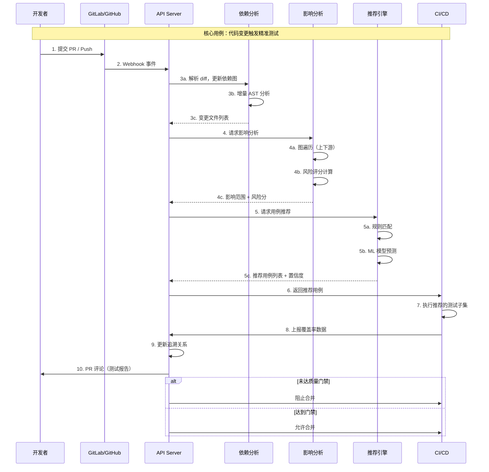
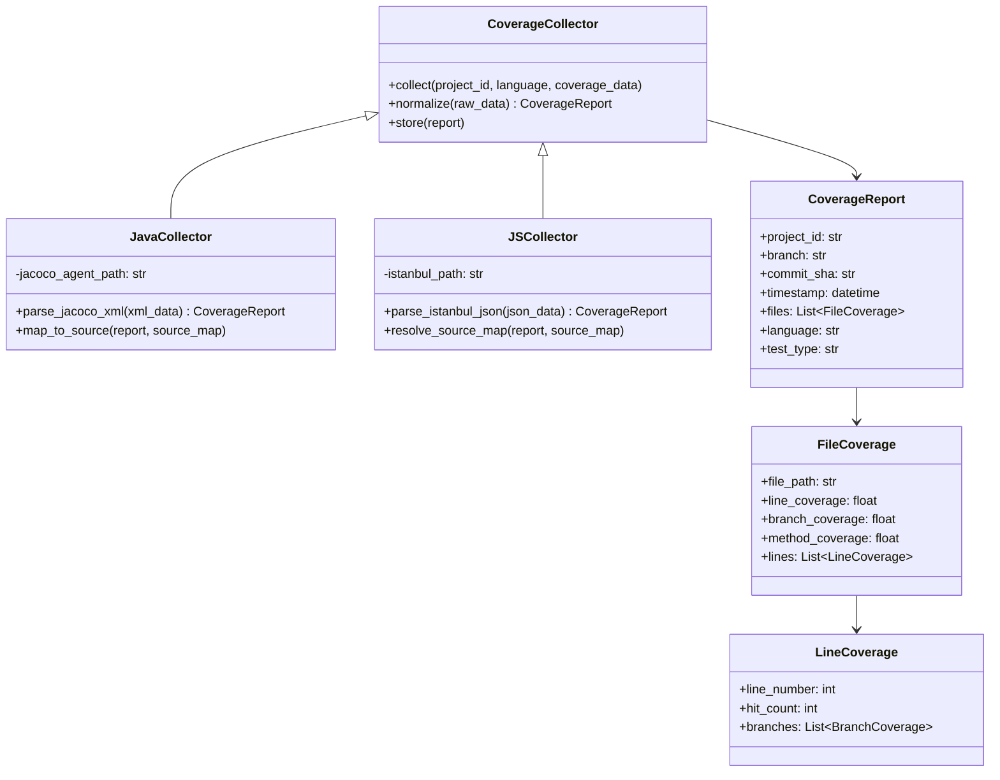
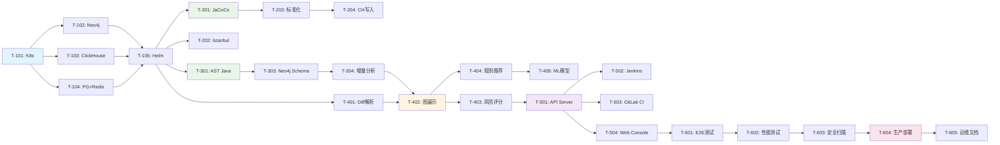

# 功能实现计划 (FIP) - PrecisionQA 精准测试平台

**文档编号**: FIP_PrecisionQA_Platform

**创建日期**: 2026-04-25

**状态**: 草稿

**作者**: PrecisionQA 团队

---

## 概述

### 概要

PrecisionQA 精准测试平台实现了基于代码分析和机器学习的测试智能化能力。该平台通过代码插桩采集覆盖率、构建代码依赖图、分析变更影响范围、智能推荐测试用例，解决"测什么、怎么测、测多少"的精准化问题。实施涵盖 6 个核心服务，计划 MVP 于 3-4 个月交付。

### 关键技术决策

| 决策 | 考虑方案 | 选定方案 | 理由 |
|------|---------|---------|------|
| 图数据库 | Neo4j, JanusGraph, NebulaGraph | Neo4j | 成熟度高，Cypher 查询语言直观，社区活跃 |
| 时序数据库 | ClickHouse, InfluxDB, TimescaleDB | ClickHouse | 列存储，聚合查询性能优，适合覆盖率时序数据 |
| 覆盖率工具 | 自研, JaCoCo+Istanbul | JaCoCo+Istanbul | 开源成熟，Java/JS 生态标准 |
| ML 框架 | TensorFlow, PyTorch, XGBoost | XGBoost | 表格数据效果好，训练快，可解释性强 |
| 后端框架 | Spring Boot, FastAPI, Go | FastAPI | 异步高性能，与 LoadForge 技术栈一致 |
| 前端框架 | Vue, Angular, React | React | 与 LoadForge 技术栈一致，组件生态丰富 |

### 风险评估摘要

| 风险 | 严重程度 | 缓解措施 | 状态 |
|------|---------|---------|------|
| Neo4j 百万级节点性能 | 🔴 严重 | 提前 POC，优化 Cypher + 索引 | 待处理 |
| ML 推荐准确率不足 | 🟡 高 | 先上规则引擎，ML 作为增强 | 待处理 |
| 插桩影响测试性能 | 🟡 高 | 仅测试环境启用，采样策略 | 待处理 |
| 多语言支持复杂度 | 🟢 中 | MVP 聚焦 Java+JS/TS | 已接受 |
| CI/CD 兼容性 | 🟢 中 | 统一抽象层 | 待处理 |

---

## 第 1 节：架构设计

### 1.1 系统架构



### 1.2 组件架构

```
┌─────────────────────────────────────────────────────────────┐
│                    PrecisionQA 平台                          │
│                                                              │
│  ┌──────────────┐  ┌──────────────┐  ┌──────────────┐       │
│  │ API Server   │  │ Coverage     │  │ Dependency   │       │
│  │ (FastAPI)    │  │ Collector    │  │ Analyzer     │       │
│  │              │  │              │  │              │       │
│  │ - REST API   │  │ - Java Agent │  │ - AST Parse  │       │
│  │ - WebSocket  │  │ - JS/TS Tool │  │ - Runtime    │       │
│  │ - Auth       │  │ - Normalize  │  │ - Graph Build│       │
│  └──────┬───────┘  └──────┬───────┘  └──────┬───────┘       │
│         │                 │                 │                │
│         └────────┬────────┘─────────────────┘                │
│                  │                                           │
│         ┌────────▼────────┐                                  │
│         │ Impact Analyzer │                                  │
│         │                 │                                  │
│         │ - Diff Parse    │                                  │
│         │ - Graph Traverse│                                  │
│         │ - Risk Score    │                                  │
│         └────────┬────────┘                                  │
│                  │                                           │
│         ┌────────▼────────┐                                  │
│         │ Recommendation  │                                  │
│         │ Engine          │                                  │
│         │                 │                                  │
│         │ - Rule Engine   │                                  │
│         │ - XGBoost Model │                                  │
│         │ - Confidence    │                                  │
│         └────────┬────────┘                                  │
│                  │                                           │
│         ┌────────▼────────┐                                  │
│         │ CI/CD Gateway   │                                  │
│         │                 │                                  │
│         │ - Quality Gate  │                                  │
│         │ - Test Trigger  │                                  │
│         └─────────────────┘                                  │
└─────────────────────────────────────────────────────────────┘
```

### 1.3 数据流



### 1.4 API 设计

| 方法 | 路径 | 描述 | 认证 | 幂等 |
|------|------|------|------|------|
| POST | `/api/v1/projects` | 创建项目 | API Key | 否 |
| GET | `/api/v1/projects` | 列出项目 | API Key | 是 |
| GET | `/api/v1/projects/{id}` | 获取项目 | API Key | 是 |
| PUT | `/api/v1/projects/{id}` | 更新项目 | API Key | 是 |
| DELETE | `/api/v1/projects/{id}` | 删除项目 | API Key | 是 |
| POST | `/api/v1/coverage/upload` | 上报覆盖率 | API Key | 否 |
| GET | `/api/v1/coverage/{project_id}` | 查询覆盖率 | API Key | 是 |
| POST | `/api/v1/analysis/impact` | 触发影响分析 | API Key | 否 |
| GET | `/api/v1/analysis/impact/{id}` | 获取分析结果 | API Key | 是 |
| POST | `/api/v1/recommendations` | 获取用例推荐 | API Key | 否 |
| GET | `/api/v1/gate/check` | 质量门禁检查 | API Key | 是 |
| WS | `/api/v1/ws/realtime` | 实时推送 | Token | - |

---

## 第 2 节：详细设计

### 2.1 代码插桩引擎

#### 类/模块图



#### 配置

```yaml
# 覆盖率采集服务配置
coverage_collector:
  name: "precisionqa-coverage-collector"
  
  # 数据接收
  server:
    host: "0.0.0.0"
    port: 8001
    max_upload_size: "50MB"
  
  # ClickHouse 写入
  clickhouse:
    table: "coverage_reports"
    batch_size: 1000
    flush_interval: "30s"
  
  # 报告存储
  storage:
    type: "minio"
    bucket: "precisionqa-reports"
    retention_days: 90
```

#### 错误处理

| 错误码 | 描述 | 恢复操作 | 升级条件 |
|--------|------|---------|---------|
| `COV_001` | 覆盖率数据格式无效 | 返回 400，提示正确格式 | 连续 > 10 次 |
| `COV_002` | ClickHouse 写入失败 | 重试 3 次，写入本地队列 | 队列积压 > 10000 |
| `COV_003` | Source Map 解析失败 | 标记为未解析，使用原始路径 | 影响率 > 50% |

### 2.2 依赖图构建引擎

#### 配置

```yaml
# 依赖分析服务配置
dependency_analyzer:
  name: "precisionqa-dependency-analyzer"
  
  # AST 解析
  parsers:
    java:
      tool: "tree-sitter-java"
      extractors: ["import", "package", "class", "method"]
    javascript:
      tool: "tree-sitter-javascript"
      extractors: ["import", "require", "export"]
    typescript:
      tool: "tree-sitter-typescript"
      extractors: ["import", "export"]
  
  # Neo4j 连接
  neo4j:
    uri: "bolt://neo4j:7687"
    database: "precisionqa"
    max_connection_pool: 50
  
  # 增量分析
  incremental:
    enabled: true
    cache_dir: "/tmp/analysis-cache"
    max_cache_size: "5GB"
```

#### 错误处理

| 错误码 | 描述 | 恢复操作 | 升级条件 |
|--------|------|---------|---------|
| `DEP_001` | AST 解析失败 | 跳过文件，记录警告 | 影响率 > 10% |
| `DEP_002` | Neo4j 写入失败 | 重试 3 次，写入本地队列 | 队列积压 > 5000 |
| `DEP_003` | 仓库克隆失败 | 重试 3 次 | 3 次失败 |

### 2.3 影响分析引擎

#### 配置

```yaml
# 影响分析服务配置
impact_analyzer:
  name: "precisionqa-impact-analyzer"
  
  # Git diff
  git:
    clone_dir: "/tmp/repos"
    clone_depth: 100
    file_filters:
      include: ["*.java", "*.js", "*.ts", "*.jsx", "*.tsx"]
      exclude: ["*.test.*", "*Test*", "node_modules/**", "target/**"]
  
  # 图遍历
  traversal:
    upstream:
      direction: "INCOMING"
      max_depth: 3
    downstream:
      direction: "OUTGOING"
      max_depth: 2
  
  # 风险评分
  risk_scoring:
    factors:
      complexity: 0.3
      defect_density: 0.4
      change_size: 0.2
      churn_rate: 0.1
    levels:
      low: [0, 30]
      medium: [31, 70]
      high: [71, 100]
```

---

## 第 3 节：安全设计

### 3.1 认证与授权

- **认证方式**: OAuth2/OIDC（集成企业 SSO）
- **授权模型**: RBAC
- **API Key**: 支持 API Key 认证（CI/CD 场景）

**角色定义**:

| 角色 | 权限 | 范围 |
|------|------|------|
| admin | 全部权限 | 全局 |
| project_admin | 项目配置、成员管理 | 项目级 |
| developer | 查看覆盖率、影响分析 | 项目级 |
| viewer | 只读 | 项目级 |

### 3.2 数据保护

- **传输中**: TLS 1.2+
- **静态**: AES-256（数据库加密）
- **凭证**: Kubernetes Secrets / Vault
- **审计日志**: 保留 90 天

### 3.3 安全检查清单

| 检查项 | 状态 |
|--------|------|
| 输入验证 | 🟡 设计中 |
| 认证 | 🟡 设计中 |
| 授权 | 🟡 设计中 |
| TLS | 🟡 设计中 |
| 静态加密 | 🟡 设计中 |
| 密钥管理 | 🟡 设计中 |
| 速率限制 | 🟡 设计中 |
| 审计日志 | 🟡 设计中 |

---

## 第 4 节：性能设计

### 4.1 性能目标

| 指标 | 目标 | 验收标准 |
|------|------|---------|
| 影响分析 P50 | < 1s | 99% 请求 |
| 影响分析 P99 | < 5s | 99% 请求 |
| 推荐接口 P99 | < 3s | 99% 请求 |
| 覆盖率上报 P99 | < 1s | 99% 请求 |
| Neo4j 查询 P99 | < 2s | 99% 查询 |
| ClickHouse 聚合 P99 | < 3s | 99% 查询 |

### 4.2 缓存策略

| 缓存键 | 数据 | TTL | 失效触发 |
|--------|------|-----|---------|
| `dep:{project}:{commit}` | 依赖图快照 | 24h | 新提交 |
| `risk:{project}:{commit}` | 风险评分 | 1h | 新提交 |
| `coverage:{project}:{branch}` | 最新覆盖率 | 30min | 新上报 |
| `rec:{project}:{commit}` | 推荐结果 | 10min | 新分析 |

### 4.3 优化模式

- **连接池**: Neo4j 50 连接，ClickHouse 20 连接
- **批处理**: 覆盖率数据批量写入（1000 条/批）
- **异步处理**: Webhook 事件异步处理（Redis 队列）
- **增量更新**: 仅分析变更文件

---

## 第 5 节：风险评估

### RISK-001: Neo4j 百万级节点性能

| 字段 | 值 |
|------|-----|
| **风险编号** | RISK-001 |
| **描述** | 大型代码库（百万级节点）的图查询性能可能不满足要求 |
| **影响** | 影响分析响应超时，用户体验差 |
| **概率** | 中 |
| **严重程度** | 🔴 严重 |
| **缓解措施** | 提前 POC（10万/100万/1000万节点），优化 Cypher + 索引，按项目/模块分图 |
| **应急预案** | 降级为文件级影响分析（不遍历到方法级） |
| **状态** | 待处理 |

### RISK-002: ML 推荐准确率不足

| 字段 | 值 |
|------|-----|
| **风险编号** | RISK-002 |
| **描述** | ML 模型推荐准确率不达预期 |
| **影响** | 用户信任度下降 |
| **概率** | 中 |
| **严重程度** | 🟡 高 |
| **缓解措施** | 先上规则引擎，ML 作为增强迭代，A/B 测试验证 |
| **应急预案** | 回退到纯规则引擎模式 |
| **状态** | 待处理 |

### RISK-003: 插桩性能影响

| 字段 | 值 |
|------|-----|
| **风险编号** | RISK-003 |
| **描述** | JaCoCo/Istanbul 插桩影响测试执行性能 |
| **影响** | CI 流水线变慢 |
| **概率** | 低 |
| **严重程度** | 🟡 高 |
| **缓解措施** | 仅测试环境启用，提供开关，采样策略 |
| **状态** | 待处理 |

---

## 第 6 节：实施计划

### 阶段 1：基础设施搭建

| 任务编号 | 任务描述 | 依赖 | 工作量 | 状态 |
|---------|---------|------|--------|------|
| T-101 | 创建 K8s 集群 (Minikube) | 无 | 2d | ❌ |
| T-102 | 部署 Neo4j (单节点) | T-101 | 1d | ❌ |
| T-103 | 部署 ClickHouse (单节点) | T-101 | 1d | ❌ |
| T-104 | 部署 PostgreSQL + Redis | T-101 | 1d | ❌ |
| T-105 | 配置 Helm Charts | T-102, T-103, T-104 | 2d | ❌ |

### 阶段 2：代码插桩引擎

| 任务编号 | 任务描述 | 依赖 | 工作量 | 状态 |
|---------|---------|------|--------|------|
| T-201 | JaCoCo Agent 集成 (Java) | T-105 | 3d | ❌ |
| T-202 | Istanbul/nyc 集成 (JS/TS) | T-105 | 2d | ❌ |
| T-203 | 覆盖率数据标准化 | T-201 | 2d | ❌ |
| T-204 | ClickHouse 写入 + 报告生成 | T-203 | 2d | ❌ |

### 阶段 3：依赖图构建引擎

| 任务编号 | 任务描述 | 依赖 | 工作量 | 状态 |
|---------|---------|------|--------|------|
| T-301 | Tree-sitter AST 解析器 (Java) | T-105 | 3d | ❌ |
| T-302 | Tree-sitter AST 解析器 (JS/TS) | T-105 | 2d | ❌ |
| T-303 | Neo4j Schema 设计 + 写入 | T-301 | 2d | ❌ |
| T-304 | 增量分析实现 | T-303 | 2d | ❌ |

### 阶段 4：影响分析 + 推荐引擎

| 任务编号 | 任务描述 | 依赖 | 工作量 | 状态 |
|---------|---------|------|--------|------|
| T-401 | Git diff 解析器 | T-105 | 2d | ❌ |
| T-402 | 图遍历算法实现 | T-304, T-401 | 3d | ❌ |
| T-403 | 风险评分模型 | T-402 | 2d | ❌ |
| T-404 | 规则引擎推荐 | T-402 | 2d | ❌ |
| T-405 | XGBoost 模型训练 | T-404 | 3d | ❌ |

### 阶段 5：CI/CD 集成 + Web Console

| 任务编号 | 任务描述 | 依赖 | 工作量 | 状态 |
|---------|---------|------|--------|------|
| T-501 | API Server (FastAPI) | T-403 | 3d | ❌ |
| T-502 | Jenkins 插件 | T-501 | 3d | ❌ |
| T-503 | GitLab CI 模板 | T-501 | 2d | ❌ |
| T-504 | Web Console (React) | T-501 | 5d | ❌ |

### 阶段 6：测试与上线

| 任务编号 | 任务描述 | 依赖 | 工作量 | 状态 |
|---------|---------|------|--------|------|
| T-601 | E2E 测试 | T-504 | 2d | ❌ |
| T-602 | 性能测试 | T-601 | 2d | ❌ |
| T-603 | 安全扫描 | T-602 | 1d | ❌ |
| T-604 | 生产部署 | T-603 | 2d | ❌ |
| T-605 | 运维文档 | T-604 | 2d | ❌ |

### 依赖关系图



### 工作量估算

| 阶段 | 任务数 | 总工作量 |
|------|--------|---------|
| 阶段 1: 基础设施 | 5 | 7d |
| 阶段 2: 插桩引擎 | 4 | 9d |
| 阶段 3: 依赖图 | 4 | 9d |
| 阶段 4: 分析+推荐 | 5 | 12d |
| 阶段 5: 集成+前端 | 4 | 13d |
| 阶段 6: 测试上线 | 5 | 9d |
| **合计** | **27** | **59d (~12 周)** |

**关键路径**: T-101 → T-105 → T-301 → T-303 → T-304 → T-402 → T-403 → T-501 → T-504 → T-601 → T-604

---

## 第 7 节：测试策略

### 单元测试
- **范围**: 所有公共方法、工具函数
- **工具**: pytest
- **覆盖率目标**: 80% 行覆盖率

### 集成测试
- **范围**: API 端点、数据库操作、Neo4j 查询
- **工具**: Testcontainers（Neo4j/ClickHouse/PostgreSQL）
- **关键场景**:
  1. 覆盖率上报 → ClickHouse 写入 → 查询验证
  2. AST 解析 → Neo4j 写入 → 图查询验证
  3. diff 解析 → 图遍历 → 影响范围验证

### E2E 测试
- **范围**: 完整 Webhook → 分析 → 推荐 → 门禁流程
- **工具**: pytest + Docker Compose

### 性能测试
- **工具**: Locust/k6
- **场景**: 影响 API 基准(100并发)、峰值(500并发)、覆盖率上报(1000并发)

### 测试覆盖矩阵

| 组件 | 单元 | 集成 | E2E | 性能 |
|------|------|------|-----|------|
| API Server | ✅ | ✅ | ✅ | ✅ |
| Coverage Collector | ✅ | ✅ | ✅ | ✅ |
| Dependency Analyzer | ✅ | ✅ | ✅ | ❌ |
| Impact Analyzer | ✅ | ✅ | ✅ | ✅ |
| Recommendation Engine | ✅ | ✅ | ✅ | ❌ |

---

## 第 8 节：监控与可观测性

### RED 指标

| 指标 | 类型 | 告警阈值 |
|------|------|---------|
| API 请求速率 | Counter | 下降 > 50% |
| API 错误率 | Counter | > 1% |
| API 延迟 P99 | Histogram | > 10s |

### USE 指标

| 指标 | 类型 | 告警阈值 |
|------|------|---------|
| CPU 利用率 | Gauge | 持续 > 80% |
| 内存利用率 | Gauge | 持续 > 85% |
| Neo4j 连接池 | Gauge | 使用率 > 80% |

### 告警规则

| 告警 | 条件 | 严重程度 | 响应 |
|------|------|---------|------|
| 服务不可用 | health check 失败 | 🔴 P1 | 15min |
| 高错误率 | > 5% 持续 5min | 🟡 P2 | 1h |
| 高延迟 | P99 > 10s 持续 5min | 🟡 P2 | 1h |

---

## 第 9 节：依赖

### 内部依赖

| 依赖项 | 类型 | 状态 |
|--------|------|------|
| LoadForge FastAPI 架构 | 代码 | ✅ 就绪 |
| LoadForge React 架构 | 代码 | ✅ 就绪 |
| LoadForge Docker 模式 | 基础设施 | ✅ 就绪 |

### 外部依赖

| 依赖项 | 版本 | 用途 | 许可证 |
|--------|------|------|--------|
| Neo4j | 5.x | 图数据库 | GPL-3.0 |
| ClickHouse | 23.x+ | 时序数据库 | Apache 2.0 |
| PostgreSQL | 15+ | 关系数据库 | PostgreSQL |
| JaCoCo | 0.8.x | Java 覆盖率 | EPL-2.0 |
| Istanbul/nyc | 15.x | JS 覆盖率 | ISC |
| Tree-sitter | 0.20+ | AST 解析 | MIT |
| XGBoost | 2.x | ML 模型 | Apache 2.0 |
| FastAPI | 0.100+ | Web 框架 | MIT |
| React | 18.x | UI 框架 | MIT |

---

## 第 10 节：上线计划

### 分阶段上线

| 阶段 | 目标 | 进入标准 | 验证 | 持续 |
|------|------|---------|------|------|
| 1 | dev | 单元测试通过 | 冒烟测试 | 1-2d |
| 2 | test | dev 验证完成 | 集成测试 | 2-3d |
| 3 | staging | test 验证完成 | 性能基线 | 3-5d |
| 4 | prod | staging 稳定 1 周 | 冒烟 + 监控 | 永久 |

### 回滚策略

| 触发条件 | 操作 | 时间 |
|---------|------|------|
| 错误率 > 5% | 回退到前一版本 | < 5min |
| 延迟 > 阈值 | 关闭新功能 | < 1min |
| 数据异常 | 从备份恢复 | < 30min |

---

## 相关文档

- **差距分析**: `GAP_precision_testing_20260425.md`
- **需求文档**: `REQ_precision_testing_20260425.md`
- **产品方案**: `docs/precision_testing/product_solution.md`

---

**文档版本**: 1.0 | **最后更新**: 2026-04-25

### 审查历史

| 版本 | 日期 | 审查人 | 结果 | 备注 |
|------|------|--------|------|------|
| 1.0 | 2026-04-25 | - | 待审查 | 初始 FIP |
