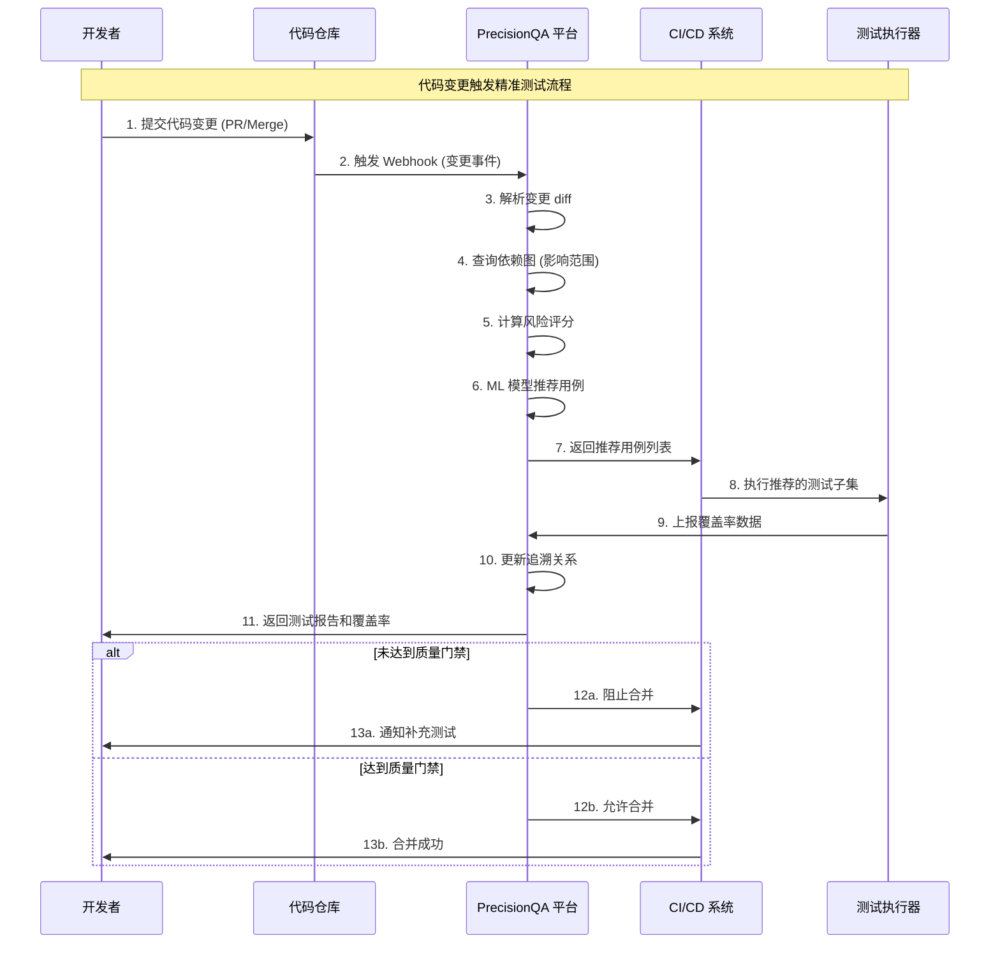

# GAP 差距分析 - PrecisionQA 精准测试平台

<!-- ==============================================================================
     指令：SPEC 编码模板 - GAP 差距分析
     ==============================================================================
     本模板专为基础设施和平台工程项目设计。
     它记录当前状态（基线），识别当前状态与目标状态之间的差距，
     评估实施方案，并提供结构化的建议与迁移路径。
     ============================================================================ -->

**文档 ID**: GAP_PrecisionQA_Platform

**关联议题**: 精准测试平台建设

**创建日期**: 2026-04-25

**分支**: 待定

**状态**: 基线评估与差距分析

---

## 执行摘要

### 当前基线状态: 🟡 **部分就绪 - 需要全面建设**

- **代码覆盖率采集**: 0%（当前无自动化覆盖率采集能力）
- **依赖关系分析**: 0%（无代码依赖图和影响分析能力）
- **测试用例管理**: 20%（依赖外部测试管理工具，无代码级追溯）
- **智能推荐引擎**: 0%（无基于变更的用例推荐能力）
- **CI/CD 集成**: 30%（有基础 CI/CD，无质量门禁）

### 关键发现

1. ✅ **LoadForge 压测平台**: 已有分布式压测平台 PoC，可作为基础设施参考
2. ✅ **Docker 容器化经验**: 团队具备容器化部署和服务编排经验
3. ✅ **Python 技术栈**: LoadForge 基于 Python/FastAPI，可复用技术栈
4. ❌ **代码覆盖率采集**: 缺少自动化覆盖率采集能力（JaCoCo/Istanbul 集成）
5. ❌ **依赖图构建**: 缺少代码依赖关系图的构建和存储能力
6. ❌ **影响分析引擎**: 缺少基于变更的自动化影响分析能力
7. ❌ **智能推荐引擎**: 缺少 ML 驱动的测试用例推荐能力
8. ❌ **追溯关系数据库**: 缺少测试用例与代码的双向追溯数据存储

### 关键差距: 从全量回归到精准测试的转型

**需求**: 建设企业级精准测试平台，实现代码级双向追溯、变更影响分析和智能用例推荐，将回归测试效率提升 90%。

#### 方案 A: 基于 SaaS 产品的集成方案（已考虑但未选择）

- **关键特征**:
  - 集成第三方精准测试 SaaS 产品（如 SeaLights、Launchable）
  - 快速上线，减少自研投入
  - 依赖外部产品能力

- **优势**:
  - 上线周期短（1-2个月）
  - 无需维护底层技术栈
  - 产品成熟度较高

- **未选择原因**:
  - 数据存储在第三方平台，存在安全和合规风险
  - 缺乏与混沌测试、压测平台的深度协同能力
  - 长期成本较高，无法形成核心资产
  - 不支持私有化部署，无法满足金融等行业客户需求

#### 方案 B: 自主研发的精准测试平台 ✅ **已选定**

**方案重点**:
- **代码插桩引擎**: 基于 JaCoCo（Java）和 Istanbul（JS/TS）的覆盖率采集
- **依赖图构建引擎**: 静态 AST 分析 + 运行时调用链采集，Neo4j 图存储
- **影响分析引擎**: 基于图遍算法的影响范围计算和风险评分
- **智能推荐引擎**: 规则引擎 + ML 模型（XGBoost/LightGBM）的混合推荐
- **CI/CD 深度集成**: Jenkins/GitLab CI/GitHub Actions 的门禁插件
- **Web Console**: React + TypeScript 的管理界面

**优势**:
- ✅ 完全自主可控，数据安全有保障
- ✅ 可与混沌测试、压测平台深度协同
- ✅ 支持私有化部署，满足合规要求
- ✅ 形成核心资产，长期 ROI 更高
- ✅ 可根据客户需求灵活定制

**✅ 决策已定**: 已选择自主研发方案进行实施

---

## 第 0 节：架构对比

### 0.1 当前架构（手工测试为主）

```
┌─────────────────────────────────────────────────────────────┐
│                    CI/CD 流水线                               │
│              (Jenkins/GitLab CI)                             │
└───────────────────────┬─────────────────────────────────────┘
                        │
                        ▼
        ┌───────────────────────────────┐
        │   全量测试执行                 │
        │   - 单元测试                   │
        │   - 集成测试                   │
        │   - E2E 测试                   │
        │   - 手工测试                   │
        └───────────────┬───────────────┘
                        │
                        ▼
        ┌───────────────────────────────┐
        │   测试报告                     │
        │   - 通过率                     │
        │   - 执行时长                   │
        └───────────────────────────────┘
                        │
                        ▼
        ┌───────────────────────────────┐
        │   人工决策                     │
        │   - 是否发布？                 │
        │   - 需要补充测试吗？           │
        └───────────────────────────────┘
```

**问题**:
- 每次执行全量测试，耗时冗长
- 无法评估代码变更的真实影响范围
- 缺乏代码与测试的追溯关系
- 测试效率低，CI 反馈慢

### 0.2 方案 B: PrecisionQA 精准测试平台架构

```
┌─────────────────────────────────────────────────────────────────────────┐
│                         PrecisionQA 精准测试平台                         │
│                                                                          │
│  ┌──────────────┐  ┌──────────────┐  ┌──────────────┐  ┌────────────┐  │
│  │ 代码仓库     │  │ CI/CD 系统   │  │ 测试管理工具 │  │ Web Console│  │
│  │ (GitLab/Git)│  │(Jenkins/GitLab│  │ (Jira/TestRail│  │  (React)   │  │
│  │              │  │     CI)      │  │              │  │            │  │
│  └──────┬───────┘  └──────┬───────┘  └──────────────┘  └──────┬─────┘  │
│         │                 │                                  │          │
│         ▼                 ▼                                  │          │
│  ┌──────────────────────────────┐                            │          │
│  │ 代码插桩引擎                 │                            │          │
│  │ - JaCoCo Agent (Java)        │                            │          │
│  │ - Istanbul (JS/TS)           │                            │          │
│  │ - 覆盖率数据采集             │                            │          │
│  └──────┬───────────────────────┘                            │          │
│         │                                                     │          │
│         ▼                                                     ▼          │
│  ┌──────────────────────────────┐  ┌──────────────────────────────┐    │
│  │ 依赖图构建引擎               │  │  数据存储层                   │    │
│  │ - 静态 AST 分析              │  │  - PostgreSQL (业务数据)     │    │
│  │ - 运行时调用链采集           │  │  - Neo4j (依赖图)            │    │
│  │ - 代码依赖图构建             │  │  - ClickHouse (覆盖指标)     │    │
│  └──────┬───────────────────────┘  │  - Redis (缓存)             │    │
│         │                          └──────────────────────────────┘    │
│         ▼                                                              │
│  ┌──────────────────────────────┐                                     │
│  │ 影响分析引擎                 │                                     │
│  │ - 变更 diff 解析             │                                     │
│  │ - 图遍历算法                 │                                     │
│  │ - 影响范围计算               │                                     │
│  │ - 风险评分                   │                                     │
│  └──────┬───────────────────────┘                                     │
│         │                                                             │
│         ▼                                                             │
│  ┌──────────────────────────────┐                                     │
│  │ 智能推荐引擎                 │                                     │
│  │ - 规则引擎                   │                                     │
│  │ - ML 模型 (XGBoost)          │                                     │
│  │ - 用例推荐                   │                                     │
│  └──────┬───────────────────────┘                                     │
│         │                                                             │
│         ▼                                                             │
│  ┌──────────────────────────────┐                                     │
│  │ CI/CD 集成                   │                                     │
│  │ - 质量门禁                   │                                     │
│  │ - 用例执行触发               │                                     │
│  │ - 覆盖率趋势分析             │                                     │
│  └──────────────────────────────┘                                     │
│                                                                          │
└─────────────────────────────────────────────────────────────────────────┘
```

**数据流** (代码变更 -> 测试推荐 -> 执行 -> 反馈):



---

## 第 1 节：当前架构基线

### 1.1 LoadForge 压测平台基础

#### ✅ 已有资产

**Docker Compose 编排** (`power-gatling/docker-compose.yml`):
```yaml
# 现有的服务编排模式
services:
  redis:
    image: redis:7-alpine
    # 消息队列和状态存储

  master:
    build: ./master
    # FastAPI 服务，提供 REST API 和 WebSocket

  worker:
    build: ./worker
    # 分布式执行节点

  frontend:
    build: ./frontend
    # React + TypeScript + Vite + Ant Design
```

**LoadForge 特性**:
- ✅ 基于 Redis 的分布式任务编排
- ✅ FastAPI 后端服务架构
- ✅ React + TypeScript 前端技术栈
- ✅ Docker 容器化部署经验
- ✅ 分布式 Worker 模式（可扩展到精准测试的代码分析节点）

#### ❌ 缺失 精准测试核心组件

```bash
# 精准测试平台组件 (严重等级 GAP)
- ❌ No 代码插桩引擎 (JaCoCo/Istanbul 集成)
- ❌ No 依赖图构建引擎 (AST 分析 + 调用链采集)
- ❌ No 影响分析引擎 (图遍历算法)
- ❌ No 智能推荐引擎 (规则 + ML 模型)
- ❌ No 追溯关系数据库 (Neo4j + ClickHouse)
- ❌ No CI/CD 门禁插件
```

**GAP 严重等级**: 🔴 **严重** - 缺少精准测试的核心能力，无法实现从全量回归到精准测试的转型

### 1.2 代码仓库与 CI/CD 基础设施

#### ✅ 已有 Git 仓库

**当前仓库结构**:
```
none-functional-testing-tools/
├── README.md
├── CLAUDE.md
├── docs/
│   ├── precision_testing/
│   │   └── product_solution.md
│   ├── chaos_testing/
│   └── stress_testing/
├── power-gatling/
│   ├── master/
│   │   └── app/
│   ├── worker/
│   ├── frontend/
│   └── docker-compose.yml
└── myspec/
    └── templates/
```

**仓库特性**:
- ✅ Git 版本控制
- ✅ Markdown 文档管理
- ✅ 产品方案文档完善

#### ❌ 缺失 精准测试专用仓库结构

```bash
# 精准测试平台代码结构 (严重等级 GAP)
- ❌ No precision-qa/ 根目录 (独立代码仓库或目录)
- ❌ No coverage-collector/ (代码插桩引擎)
- ❌ No dependency-analyzer/ (依赖图构建引擎)
- ❌ No impact-analyzer/ (影响分析引擎)
- ❌ No recommendation-engine/ (智能推荐引擎)
- ❌ No ci-plugins/ (Jenkins/GitLab CI/GitHub Actions 插件)
- ❌ No web-console/ (管理界面，可复用 LoadForge 架构)
```

**GAP 严重等级**: 🔴 **严重** - 需要建立完整的平台代码结构

### 1.3 技术栈基础

#### ✅ 已有技术栈

**LoadForge 技术栈**:
- ✅ 后端: Python 3.11+ + FastAPI + Uvicorn
- ✅ 前端: React 18 + TypeScript + Vite + Ant Design + Recharts
- ✅ 数据存储: Redis (Pub/Sub + 状态存储)
- ✅ 消息队列: Redis Pub/Sub
- ✅ 容器化: Docker + Docker Compose
- ✅ 部署: 容器编排（可扩展到 Kubernetes）

#### ❌ 缺失 精准测试必需技术栈

```bash
# 精准测试平台技术栈 (严重等级 GAP)
- ❌ No 图数据库: Neo4j (依赖图存储)
- ❌ No 指标存储: ClickHouse (覆盖率时序数据)
- ❌ No 关系数据库: PostgreSQL (业务元数据)
- ❌ No 代码分析: Tree-sitter (多语言 AST 解析)
- ❌ No ML 框架: XGBoost/LightGBM (推荐模型)
- ❌ No 代码插桩: JaCoCo (Java)、Istanbul (JS/TS)
```

**GAP 严重等级**: 🔴 **严重** - 缺少图数据库、时序数据库和代码分析工具

### 1.4 数据存储基线

#### ✅ 已有数据存储

**LoadForge 数据存储**:
- ✅ Redis: 任务状态、Pub/Sub 消息传递
- ✅ 文件系统: Gatling 测试脚本、执行结果

#### ❌ 缺失 精准测试数据存储

```bash
# 精准测试数据存储 (严重等级 GAP)
- ❌ No Neo4j: 代码依赖图 (节点: 类/方法/文件, 边: 调用关系)
- ❌ No ClickHouse: 覆盖率时序数据 (行/分支/方法级别)
- ❌ No PostgreSQL: 业务元数据 (项目/用例/执行记录)
- ❌ No S3/MinIO: 覆盖率报告文件存储
```

**GAP 严重等级**: 🔴 **严重** - 需要图数据库存储依赖关系，时序数据库存储覆盖率指标

---

## 第 2 节：PrecisionQA 平台分析

### 2.1 核心能力分析

#### ✅ 代码覆盖率采集

**覆盖率类型**:
- ✅ 行覆盖 (Line Coverage)
- ✅ 分支覆盖 (Branch Coverage)
- ✅ 方法覆盖 (Method Coverage)
- ✅ 路径覆盖 (Path Coverage) - 高级特性

**支持语言**:
- ✅ Java (JaCoCo)
- ✅ JavaScript/TypeScript (Istanbul/nyc)
- ✅ Go (go test -cover)
- ✅ Python (pytest-cov)
- ✅ C/C++ (gcov)

#### ❌ 缺失 高级覆盖能力

```bash
# 高级覆盖能力 (严重等级 GAP)
- ❌ No 条件覆盖 (Condition Coverage)
- ❌ No MC/DC 覆盖 (Modified Condition/Decision Coverage) - 航空/汽车行业标准
- ❌ No 数据流覆盖 (Data Flow Coverage)
```

**GAP 严重等级**: 🟢 **中** - 基础覆盖能力满足 MVP 需求，高级覆盖能力可后续迭代

### 2.2 对比分析

| 方面 | SaaS 集成方案 | PrecisionQA 自研方案 |
|------|-------------|-------------------|
| **上线周期** | 1-2 个月 | 6-9 个月 |
| **数据安全** | 第三方存储（风险） | 完全自主可控 |
| **定制能力** | 受限于产品能力 | 可根据需求深度定制 |
| **成本（3年TCO）** | 按用户订阅，持续支出 | 初期投入高，长期更低 |
| **平台协同** | 无法与混沌/压测协同 | 三合一平台协同 |
| **私有化部署** | 通常不支持 | 完全支持 |
| **合规性** | 数据出境风险 | 满足金融/政务合规 |

**建议**: 选择 PrecisionQA 自研方案，满足企业级客户的安全、合规和定制需求

### 2.3 实施差距

#### 基础设施层 (Docker + Kubernetes)
```bash
# 基础设施 (严重等级 GAP)
- ❌ No Kubernetes 集群配置 (多容器编排)
- ❌ No Helm Charts (应用包管理)
- ❌ No 服务网格 (Istio，可选)
```

#### 数据存储层 (Neo4j + ClickHouse + PostgreSQL)
```bash
# 数据存储 (严重等级 GAP)
- ❌ No Neo4j 集群部署 (图数据库)
- ❌ No ClickHouse 集群部署 (时序数据库)
- ❌ No PostgreSQL 高可用配置 (主从复制)
```

#### 后端服务层 (FastAPI + Python)
```bash
# 后端服务 (严重等级 GAP)
- ❌ No 代码插桩引擎服务
- ❌ No 依赖图构建服务
- ❌ No 影响分析服务
- ❌ No 智能推荐服务
- ❌ No CI/CD 集成服务
```

#### 前端层 (React + TypeScript)
```bash
# 前端界面 (严重等级 GAP)
- ❌ No 项目管理界面
- ❌ No 覆盖率可视化界面
- ❌ No 影响分析界面
- ❌ No 用例推荐界面
- ❌ No 质量趋势看板
```

#### CI/CD 集成层
```bash
# CI/CD 集成 (严重等级 GAP)
- ❌ No Jenkins 插件
- ❌ No GitLab CI 集成
- ❌ No GitHub Actions 集成
- ❌ No 质量门禁配置
```

---

## 第 3 节：基础设施差距分析

### 3.1 网络基础设施

#### ✅ 已有网络

**LoadForge 网络模式**:
- ✅ Docker Compose 默认网络 (bridge)
- ✅ 服务间通信通过容器名解析
- ✅ 端口映射到宿主机

#### ❌ 缺失 生产级网络配置

```bash
# 生产网络 (严重等级 GAP)
- ❌ No Kubernetes 集群网络 (CNI 插件)
- ❌ No 服务发现 (CoreDNS)
- ❌ No Ingress 控制器 (Nginx/Traefik)
- ❌ No 网络策略 (NetworkPolicy，微服务隔离)
```

**GAP 严重等级**: 🟡 **高** - 开发环境可使用 Docker Compose，生产环境需要 K8s

### 3.2 安全配置

#### ✅ 已有安全模式

**LoadForge 安全**:
- ✅ 容器非 root 用户运行
- ✅ 最小权限原则

#### ❌ 缺失 企业级安全组件

```bash
# 安全组件 (严重等级 GAP)
- ❌ No 认证鉴权 (OAuth2/OIDC)
- ❌ No 审计日志 (操作记录)
- ❌ No 敏感数据加密 (KMS 集成)
- ❌ No RBAC 权限控制 (基于角色的访问控制)
```

**GAP 严重等级**: 🟡 **高** - 企业级平台必须具备完整的认证鉴权和审计能力

### 3.3 监控与日志

#### ✅ 已有监控

**LoadForge 监控**:
- ✅ 容器健康检查
- ✅ Docker logs 日志输出

#### ❌ 缺失 生产级监控

```bash
# 监控组件 (严重等级 GAP)
- ❌ No Prometheus (指标采集)
- ❌ No Grafana (可视化仪表盘)
- ❌ No Loki/ELK (日志聚合)
- ❌ No Jaeger/Zipkin (分布式追踪)
```

**GAP 严重等级**: 🟡 **高** - 需要完整的可观测性栈

---

## 第 4 节：实施差距分析

### 4.1 代码库结构

#### ✅ 已有代码模式

**LoadForge 代码组织**:
```
power-gatling/
├── master/app/         # FastAPI 服务
├── worker/             # Worker 节点
├── frontend/           # React 前端
└── docker-compose.yml  # 容器编排
```

#### ❌ 缺失 PrecisionQA 代码结构

```bash
# PrecisionQA 代码结构 (严重等级 GAP)
- ❌ No precision-qa/ 根目录
- ❌ No services/coverage-collector/ (覆盖率采集服务)
- ❌ No services/dependency-analyzer/ (依赖分析服务)
- ❌ No services/impact-analyzer/ (影响分析服务)
- ❌ No services/recommendation-engine/ (推荐引擎服务)
- ❌ No storage/neo4j/ (图数据库 Schema)
- ❌ No storage/clickhouse/ (时序数据库 Schema)
- ❌ No storage/postgres/ (关系数据库 Schema)
- ❌ No web-console/ (管理界面)
- ❌ No ci-plugins/jenkins/ (Jenkins 插件)
- ❌ No ci-plugins/gitlab-ci/ (GitLab CI 集成)
```

**GAP 严重等级**: 🔴 **严重** - 需要建立完整的平台代码结构

### 4.2 CI/CD 流水线

#### ✅ 已有 CI/CD 模式

**当前部署**:
- ✅ 手动执行 `./scripts/setup.sh`
- ✅ Docker Compose 一键启动

#### ❌ 缺失 自动化流水线

```bash
# CI/CD 流水线 (严重等级 GAP)
- ❌ No GitHub Actions / GitLab CI 配置
- ❌ No 自动化测试 (单元/集成/E2E)
- ❌ No 代码质量扫描 (SonarQube)
- ❌ No 安全扫描 (Trivy/Snyk)
- ❌ No 自动化部署 (Helm / Kustomize)
```

**GAP 严重等级**: 🟡 **高** - 需要建立完整的 DevOps 流水线

---

## 第 5 节：迁移路径分析

### 5.1 自主研发方案迁移路径

**阶段 1: 基础设施搭建（1-2 个月）**
1. ✅ 搭建 Kubernetes 集群 (开发环境: Minikube/k3d)
2. ✅ 部署 Neo4j 集群 (单节点开发，3 节点生产)
3. ✅ 部署 ClickHouse 集群 (单节点开发，3 节点生产)
4. ✅ 部署 PostgreSQL (主从复制)
5. ✅ 部署 Redis (缓存和消息队列)
6. ✅ 配置 Helm Charts (应用包管理)
7. ✅ 配置 Ingress 控制器 (Nginx)

**阶段 2: 代码插桩引擎开发（2-3 个月）**
1. ✅ JaCoCo Agent 集成 (Java 覆盖率采集)
2. ✅ Istanbul/nyc 集成 (JS/TS 覆盖率采集)
3. ✅ 覆盖率数据标准化 (统一数据模型)
4. ✅ ClickHouse 数据写入 (时序存储)
5. ✅ 覆盖率报告生成 (HTML/JSON)

**阶段 3: 依赖图构建引擎开发（2-3 个月）**
1. ✅ Tree-sitter AST 解析器集成 (多语言支持)
2. ✅ 静态依赖关系提取 (import/module 解析)
3. ✅ 运行时调用链采集 (Java Agent, JS Profiler)
4. ✅ Neo4j 图数据模型设计 (节点/边 Schema)
5. ✅ 图数据写入和查询 (Cypher 优化)

**阶段 4: 影响分析引擎开发（1-2 个月）**
1. ✅ Git diff 解析器 (变更识别)
2. ✅ 图遍历算法实现 (BFS/DFS，影响范围查询)
3. ✅ 风险评分模型 (代码复杂度 + 历史缺陷密度)
4. ✅ REST API 设计 (影响分析查询接口)

**阶段 5: 智能推荐引擎开发（2-3 个月）**
1. ✅ 规则引擎实现 (基于依赖图的精确匹配)
2. ✅ ML 特征工程 (历史测试运行数据)
3. ✅ XGBoost 模型训练 (用例推荐预测)
4. ✅ 推荐结果排序 (置信度计算)
5. ✅ A/B 测试框架 (推荐效果验证)

**阶段 6: CI/CD 集成（1-2 个月）**
1. ✅ Jenkins 插件开发 (质量门禁)
2. ✅ GitLab CI 集成 (CI Job 模板)
3. ✅ GitHub Actions 集成 (Action Market 发布)
4. ✅ 覆盖率趋势分析 (历史数据聚合)

**阶段 7: Web Console 开发（2-3 个月）**
1. ✅ 项目管理界面 (项目/环境/分支配置)
2. ✅ 覆盖率可视化 (代码热力图，趋势图)
3. ✅ 影响分析界面 (变更影响树形展示)
4. ✅ 用例推荐界面 (推荐列表，手动调整)
5. ✅ 质量趋势看板 (团队/项目维度)

**阶段 8: 测试与上线（1-2 个月）**
1. ✅ 端到端测试 (完整流程验证)
2. ✅ 性能测试 (大规模代码库压测)
3. ✅ 安全扫描 (依赖漏洞，代码安全)
4. ✅ 生产环境部署 (高可用配置)
5. ✅ 运维文档编写 (用户手册，故障排查指南)

### 5.2 当前状态 -> 目标状态

**当前架构**:
```
代码变更 → 全量测试 → 人工决策 → 发布
```

**目标架构**:
```
代码变更 → 影响分析 → 精准推荐 → 执行子集 → 自动门禁 → 发布
```

### 5.3 迁移步骤（详细）

#### 阶段 1: 基础设施搭建
1. ✅ 创建 `precision-qa` 代码仓库
2. ✅ 初始化 Kubernetes 配置 (Helm Charts)
3. ✅ 部署开发环境 (Minikube + Neo4j + ClickHouse + PostgreSQL)
4. ✅ 配置服务发现和 Ingress
5. ✅ 建立 CI/CD 流水线骨架

#### 阶段 2: 核心引擎开发
1. ✅ 实现代码插桩引擎 (Java + JS/TS)
2. ✅ 实现依赖图构建引擎 (静态 + 动态)
3. ✅ 实现影响分析引擎 (图遍历 + 风险评分)
4. ✅ 实现智能推荐引擎 (规则 + ML)
5. ✅ 编写各引擎的单元测试和集成测试

#### 阶段 3: 数据存储与 API
1. ✅ 设计 Neo4j 图数据 Schema
2. ✅ 设计 ClickHouse 时序数据 Schema
3. ✅ 设计 PostgreSQL 业务数据 Schema
4. ✅ 实现 REST API (FastAPI)
5. ✅ 实现 WebSocket (实时推送)

#### 阶段 4: CI/CD 集成
1. ✅ 开发 Jenkins 插件
2. ✅ 开发 GitLab CI 集成
3. ✅ 开发 GitHub Actions 集成
4. ✅ 实现质量门禁逻辑
5. ✅ 编写 CI/CD 集成文档

#### 阶段 5: Web Console
1. ✅ 搭建 React + TypeScript 项目
2. ✅ 实现项目管理界面
3. ✅ 实现覆盖率可视化
4. ✅ 实现影响分析界面
5. ✅ 实现用例推荐界面

#### 阶段 6: 部署与测试
1. ✅ 部署到 Staging 环境
2. ✅ 运行端到端测试
3. ✅ 运行性能测试
4. ✅ 部署到生产环境
5. ✅ 启用监控和告警

---

## 第 6 节：风险评估

### 6.1 高风险领域

1. **Neo4j 图数据库性能风险**
   - **风险**: 大型代码库（百万级节点）的图查询性能可能不满足要求
   - **缓解措施**:
     - 预先进行性能基准测试（10万/100万/1000万节点）
     - 优化 Cypher 查询语句，使用索引
     - 考虑图数据分片（按项目/模块）
     - 冷热数据分离（历史数据归档）

2. **ML 推荐模型效果风险**
   - **风险**: ML 模型推荐准确率不高，无法达到预期效果
   - **缓解措施**:
     - 先实现规则引擎，保证基础可用性
     - ML 模型作为增强功能，逐步迭代
     - 建立 A/B 测试框架，持续优化
     - 提供人工干预和反馈机制

3. **代码插桩性能开销**
   - **风险**: JaCoCo/Istanbul 插桩可能影响应用性能
   - **缓解措施**:
     - 插桩仅用于测试环境，生产环境禁用
     - 使用采样策略（按时间/请求采样）
     - 提供插桩开关，可动态启用/禁用

4. **多语言支持复杂度**
   - **风险**: 支持 Java/JS/Go/Python/C++ 多语言显著增加开发复杂度
   - **缓解措施**:
     - MVP 聚焦 Java + JS/TS（覆盖 80% 场景）
     - 后续迭代逐步扩展语言支持
     - 采用可插拔架构，降低新增语言成本

### 6.2 中等风险领域

1. **CI/CD 集成兼容性**
   - **风险**: 不同 CI/CD 系统的集成接口差异大，维护成本高
   - **缓解措施**:
     - 设计统一的集成抽象层
     - 优先支持主流 CI/CD（Jenkins + GitLab CI + GitHub Actions）
     - 提供标准 REST API，支持自定义集成

2. **数据迁移和升级**
   - **风险**: 图数据库 Schema 变更可能导致数据迁移问题
   - **缓解措施**:
     - Schema 设计时预留扩展字段
     - 编写数据迁移脚本和回滚脚本
     - 在 Staging 环境充分测试

3. **用户学习曲线**
   - **风险**: 精准测试平台概念复杂，用户上手难度高
   - **缓解措施**:
     - 提供详细的使用文档和视频教程
     - 设计直观的 UI/UX
     - 提供 Onboarding 向导
     - 建立用户支持渠道

---

## 第 7 节：建议

### 7.1 选定方案: PrecisionQA 自主研发 ✅ **决策已定**

**决策**: 已选择自主研发方案进行实施。

**理由**:
1. ✅ **数据安全可控**: 满足金融、政务等行业客户的合规要求
2. ✅ **平台协同效应**: 可与混沌测试、压测平台深度协同，形成独特竞争优势
3. ✅ **长期 ROI 更高**: 初期投入大，但长期成本更低，形成核心资产
4. ✅ **定制能力强**: 可根据客户需求深度定制，增强客户粘性
5. ✅ **技术栈复用**: LoadForge 的技术栈（FastAPI + React + Docker）可复用

**实施优先级**:
1. **高**: 基础设施搭建（K8s + Neo4j + ClickHouse + PostgreSQL）
2. **高**: 代码插桩引擎（Java + JS/TS）
3. **高**: 依赖图构建引擎（静态 + 动态）
4. **高**: 影响分析引擎（图遍历 + 风险评分）
5. **中**: 智能推荐引擎（规则引擎优先，ML 模型后续）
6. **中**: CI/CD 集成（Jenkins + GitLab CI 优先）
7. **中**: Web Console（核心界面优先）
8. **低**: 多语言扩展（Go/Python/C++ 后续迭代）

### 7.2 分阶段交付策略

**MVP (最小可行产品) - 3-4 个月**:
- Java + JS/TS 代码覆盖率采集
- 静态依赖图构建（不包含运行时调用链）
- 基于依赖图的影响分析
- 规则引擎推荐（不包含 ML 模型）
- Jenkins 插件集成
- 基础 Web Console

**V1.0 (正式版本) - 6-8 个月**:
- + 运行时调用链采集
- + ML 推荐模型
- + GitLab CI/GitHub Actions 集成
- + 覆盖率趋势分析
- + 质量门禁配置
- + 完整 Web Console

**V2.0 (企业版) - 9-12 个月**:
- + 多语言支持（Go/Python/C++）
- + 高级覆盖率（条件覆盖/MC/DC）
- + LLM 辅助用例生成
- + 与混沌测试平台联动
- + 与压测平台联动

---

## 第 8 节：成功标准

### MVP 成功标准

**基础设施**:
- [ ] Kubernetes 集群部署完成（开发环境）
- [ ] Neo4j + ClickHouse + PostgreSQL 部署完成
- [ ] Helm Charts 配置完成

**核心能力**:
- [ ] Java 项目覆盖率采集成功率 > 95%
- [ ] JS/TS 项目覆盖率采集成功率 > 95%
- [ ] 依赖图构建准确率 > 90%（基于人工抽检）
- [ ] 影响分析召回率 > 80%（变更相关用例推荐）

**集成**:
- [ ] Jenkins 插件发布到 Plugin Market
- [ ] 至少 1 个试点项目成功接入
- [ ] 试点项目回归测试时间减少 > 50%

**性能**:
- [ ] 覆盖率数据采集开销 < 10%（测试执行时间增长）
- [ ] 影响分析 API 响应时间 P99 < 5s（万级变更）
- [ ] Web Console 页面加载时间 < 3s

### V1.0 成功标准

**功能**:
- [ ] ML 推荐模型准确率 > 70%（基于 A/B 测试）
- [ ] GitLab CI/GitHub Actions 集成完成
- [ ] 覆盖率趋势看板可用

**业务价值**:
- [ ] 至少 3 个项目正式使用
- [ ] 回归测试效率提升 > 70%（执行时间减少）
- [ ] 覆盖率盲区减少 > 50%（新增覆盖率数据）

**稳定性**:
- [ ] 服务可用性 > 99%（月度）
- [ ] P0 事故数 = 0

---

## 第 9 节：依赖项

### 9.1 外部依赖

| 依赖项 | 负责方 | 延迟影响 | 缓解措施 |
|-------|--------|---------|---------|
| Kubernetes 集群资源 | 运维团队 | 阻塞开发环境搭建 | 使用 Minikube/k3d 临时替代 |
| Neo4j 技术支持 | Neo4j 官方/社区 | 性能优化受阻 | 提前进行 POC 验证 |
| ClickHouse 技术支持 | ClickHouse 社区 | 性能优化受阻 | 参考业界最佳实践 |

### 9.2 内部依赖

| 依赖项 | 状态 | 需求方 |
|-------|------|--------|
| LoadForge 压测平台代码结构 | ✅ 已完成 | 复用 FastAPI + React 技术栈 |
| Docker 容器化经验 | ✅ 已完成 | 复用部署模式 |
| 产品方案文档 | ✅ 已完成 | 需求输入 |

### 9.3 参考实现

- **FastAPI 服务架构**: `power-gatling/master/app/`
- **React 前端架构**: `power-gatling/frontend/`
- **Docker Compose 编排**: `power-gatling/docker-compose.yml`
- **产品方案文档**: `docs/precision_testing/product_solution.md`

---

## 第 10 节：后续步骤

### 10.1 即时行动

1. **创建 precision-qa 代码仓库**
   - 初始化 Git 仓库
   - 建立基础目录结构

2. **搭建开发环境**
   - 部署 Minikube/k3d
   - 部署 Neo4j + ClickHouse + PostgreSQL
   - 配置 Helm Charts

3. **技术预研**
   - JaCoCo Agent 集成验证
   - Istanbul/nyc 集成验证
   - Tree-sitter AST 解析验证

### 10.2 短期行动

1. **代码插桩引擎开发**
   - Java 覆盖率采集
   - JS/TS 覆盖率采集
   - 覆盖率数据标准化

2. **依赖图构建引擎开发**
   - 静态依赖分析
   - Neo4j 图数据模型设计

3. **影响分析引擎开发**
   - Git diff 解析
   - 图遍历算法实现

### 10.3 长期行动

1. **智能推荐引擎开发**
   - 规则引擎实现
   - ML 模型训练和部署

2. **CI/CD 集成**
   - Jenkins 插件开发
   - GitLab CI/GitHub Actions 集成

3. **Web Console 开发**
   - 项目管理界面
   - 覆盖率可视化
   - 影响分析界面

---

## 相关文档

- **产品方案**: `docs/precision_testing/product_solution.md`
- **Spec Coding 参考文档**: `myspec/references/README.md`
- **LoadForge 架构**: `power-gatling/README.md`

---

**文档版本**: 1.0
**最后更新**: 2026-04-25
**变更说明**: 初始 GAP 分析
**下次审查**: 2026-05-09（2周后）
